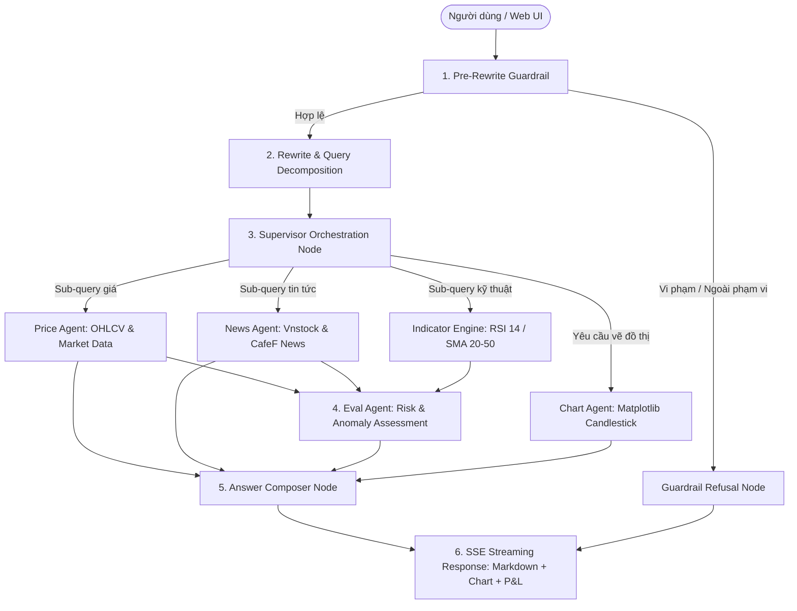

# VN Stock Swarm — Multi-Agent Stock Assistant & Portfolio Watch

Hệ thống trợ lý phân tích chứng khoán Việt Nam và quản lý danh mục đa người dùng (Multi-tenant Portfolio Watch) ứng dụng kiến trúc **Multi-Agent Swarm (LangGraph)**, phát triển theo phương pháp **Spec-Driven Development** (SDD).

---

## 1. App Idea & Mục Tiêu Dự Án

Dự án hướng tới việc xây dựng một hệ sinh thái AI toàn diện hỗ trợ nhà đầu tư cá nhân trên thị trường chứng khoán Việt Nam:
1. **Kiến Trúc Multi-Agent Swarm Chuyên Biệt**: Phối hợp các Agent chuyên trách (Guardrail, Rewrite & Query Decomposition, Supervisor, Price, News, Indicator, Chart, Eval, AnswerComposer) để giải quyết từ câu hỏi đơn giản đến bài toán phân tích so sánh đa chiều.
2. **Quản Lý Danh Mục & P&L Đa Người Dùng (Multi-tenant Portfolio)**: Theo dõi số lượng nắm giữ, giá vốn mua vào, tính toán Unrealized P&L (VND và %), tổng giá trị tài sản ròng (NAV) và danh mục theo dõi (Watchlist) riêng biệt cho từng người dùng qua `user_id`.
3. **Đánh Giá Rủi Ro Định Lượng & Tin Tức (EvalAgent)**: Kết hợp chỉ báo kỹ thuật định lượng (RSI 14, SMA 20, SMA 50, Golden/Death Cross) và tin tức tài chính đa nguồn (Vnstock, CafeF, Vietstock) để phân tích biến động khách quan, trung thực.
4. **Chuẩn Hóa Cấu Trúc Monorepo (Root Flat Structure)**: Tinh gọn cấu trúc thư mục, đưa toàn bộ mã nguồn ra thư mục gốc để quản trị tập trung, tối ưu quy trình Docker và CI/CD GitHub Actions.
5. **Đánh Giá Toàn Diện (Comprehensive Golden Dataset & Observation)**: Xây dựng bộ testcase mẫu tối giản nhưng bao quát toàn bộ chức năng, ghi nhận đầy đủ trace, token usage, latency và cost tracking.

---

## 2. Tổng Hợp Toàn Bộ Chức Năng Của Hệ Thống (Feature Inventory)

| Phân hệ / Chức năng | Mô tả chi tiết | Agent / Module đảm nhiệm |
| :--- | :--- | :--- |
| **1. Tra cứu giá & dữ liệu thị trường** | Lấy giá khớp lệnh, mức tăng/giảm, biến động ngày, lịch sử giá 10 phiên, hỗ trợ fallback dữ liệu mẫu khi sàn đóng cửa/lỗi mạng. | `PriceAgent`, `VnstockPriceSource` |
| **2. Bảng theo dõi 10D Market Matrix** | Endpoint `/api/v1/market/matrix-10d` cung cấp ma trận giá 10 ngày kèm sparkline của top cổ phiếu VN30. | `MarketService`, `MarketRouter` |
| **3. Tổng hợp tin tức tài chính** | Cào và tổng hợp tin tức nóng, tin doanh nghiệp từ Vnstock News và CafeF, trích dẫn nguồn minh bạch. | `NewsAgent`, `CafefNewsSource` |
| **4. Động cơ chỉ báo kỹ thuật** | Tính toán tự động RSI(14), SMA(20), SMA(50), xác định tín hiệu giao cắt xu hướng Golden Cross / Death Cross. | `TechnicalIndicatorService`, `domain.indicators` |
| **5. Đánh giá bất thường & rủi ro** | Phân loại mức độ nghiêm trọng (`none`, `low`, `medium`, `high`) dựa trên chỉ số kỹ thuật và độ nóng của tin tức. | `EvalAgent` |
| **6. Phân rã câu hỏi đa ý (Decomposition)** | Tự động nhận diện câu hỏi so sánh hoặc đa mã (VD: *"So sánh giá và tin tức của FPT với HPG"*), tách thành các sub-queries độc lập để gom đủ dữ liệu. | `RewriteBrain`, `supervisor_agent.nodes` |
| **7. Quản lý danh mục & Lãi/Lỗ (P&L)** | Lưu trữ số lượng, giá vốn, ngày mua; tự động tính Unrealized P&L, tỷ suất lợi nhuận và tổng NAV theo từng `user_id`. | `PortfolioService`, `PortfolioHoldingRepository` |
| **8. Danh mục theo dõi & Cảnh báo (Watchlist)** | Thêm/bớt mã theo dõi, cài đặt ngưỡng cảnh báo biến động (`alert_threshold_pct`) riêng cho từng người dùng. | `WatchlistStore`, `UserSettingsRepository` |
| **9. Vẽ biểu đồ nến & chỉ báo (Chart)** | Sinh biểu đồ nến kỹ thuật kết hợp SMA bằng Matplotlib, phục vụ trực tiếp qua URL ảnh tĩnh trong phản hồi SSE. | `ChartAgent` |
| **10. Tường lửa an toàn (Guardrails)** | Chặn 100% Prompt Injection, từ chối câu hỏi ngoài phạm vi chứng khoán, kèm miễn trừ trách nhiệm đầu tư trung lập. | `PreRewriteGuardrail`, `AnswerComposer` |
| **11. Web App Trực Quan & Live Graph** | Giao diện Chat Markdown streaming (SSE), hiển thị đồ thị mạng lưới Agent theo thời gian thực (hover xem system prompt), bảng P&L và bộ chuyển người dùng (User Switcher). | `src/frontend/`, `src/backend/main.py` |
| **12. Vận hành & Tin cậy (DevOps / CI/CD)** | A/B Testing prompt (`production` vs `v2`), fallback đa backend LLM (OpenAI, Ollama, vLLM), Docker Compose, GitHub Actions CI/CD. | `infra.llm`, `.github/workflows/` |

---

## 3. Kiến Trúc Multi-Agent Swarm



---

## 4. Tài Liệu Spec-Driven Development (SDD)

Bộ tài liệu đặc tả được duy trì tại thư mục `specs/`:
* [specs/product-spec.md](specs/product-spec.md): Đặc tả sản phẩm, yêu cầu chức năng, phi chức năng và Tiêu chí nghiệm thu (Acceptance Criteria).
* [specs/implementation-plan.md](specs/implementation-plan.md): Kế hoạch triển khai theo từng Phase rõ ràng, bám sát MVP.
* [specs/test-plan.md](specs/test-plan.md): Kế hoạch kiểm thử 5 lớp (Unit test, AC verification, Golden dataset eval, Observation, Demo script).
* [specs/change-log.md](specs/change-log.md): Nhật ký chi tiết tiến trình cập nhật và kết quả nghiệm thu.
* [AGENTS.md](AGENTS.md): Bản quy tắc ứng xử bắt buộc dành cho các AI Coding Assistant.

---

## 5. Hướng Dẫn Cài Đặt & Chạy Cục Bộ

### Yêu Cầu Môi Trường
* Python >= 3.10 (khuyến nghị Python 3.11 hoặc 3.12)
* SQLite 3
* Git
* Docker & Docker Compose (tùy chọn nếu chạy container)

### Cài Đặt Ban Đầu
```bash
# 1. Khởi tạo và kích hoạt virtual environment
# Windows:
py -m venv $HOME\.venv
& "$HOME\.venv\Scripts\Activate.ps1"
# Linux / macOS:
python3 -m venv ~/.venv
source ~/.venv/bin/activate

# 2. Cài đặt dependencies
pip install -U pip setuptools wheel
pip install -e ".[dev]"

# 3. Tạo file cấu hình môi trường từ .env.example
# Windows (PowerShell):
Copy-Item .env.example .env
# Linux / macOS:
cp .env.example .env
```

### Chạy Cục Bộ Nhanh Bằng Script Tự Động (Khuyến Nghị)

Dự án cung cấp sẵn scripts tiện lợi tự động định vị venv, thiết lập `PYTHONPATH=src`, kiểm tra `.env` và khởi động máy chủ Uvicorn:

* **Trên Windows (PowerShell):**
  ```powershell
  .\scripts\run_local.ps1
  ```
  *(Có thể tùy biến: `.\scripts\run_local.ps1 -Port 8000 -HostAddress 127.0.0.1`)*

* **Trên Linux / macOS (Bash):**
  ```bash
  chmod +x ./scripts/run_local.sh
  ./scripts/run_local.sh
  ```

### Chạy Cục Bộ Thủ Công
Nếu muốn tự điều khiển qua dòng lệnh:
```bash
# Windows (PowerShell):
$env:PYTHONPATH="src"
python -m uvicorn backend.main:app --host 127.0.0.1 --port 8000 --reload

# Linux / macOS (Bash):
export PYTHONPATH="src"
python -m uvicorn backend.main:app --host 127.0.0.1 --port 8000 --reload
```

* **Giao diện Web UI (App):** `http://localhost:8000` (hoặc `http://127.0.0.1:8000`)
* **Tài liệu API (Swagger UI):** `http://localhost:8000/docs`
* **Kiểm tra sức khỏe (Health Check):** `http://localhost:8000/health`

### Vận Hành Qua Docker Compose

Hệ thống được thiết kế theo kiến trúc Microservices tối ưu: image chỉ chứa runtime Python và thư viện; mã nguồn ứng dụng, resources, và specs được mount trực tiếp ở runtime. Entrypoint script tự động phân quyền volume cho non-root user `appuser` (UID 10001).

```bash
# 1. Build images (chỉ cần chạy lần đầu hoặc khi cập nhật pyproject.toml)
docker compose build

# 2. Khởi động toàn bộ dịch vụ ở chế độ background
docker compose up -d

# 3. Xem nhật ký log của backend
docker compose logs -f backend

# 4. Khi sửa đổi code / cấu hình .env (không cần build lại)
docker compose up -d --force-recreate

# 5. Dừng các dịch vụ
docker compose down
```

* **Frontend UI (Nginx Web):** `http://localhost:3001` (tránh xung đột port 3000 của Langfuse)
* **Backend API & Direct Web:** `http://localhost:8000`
* **Langfuse Tracing UI (nếu có):** `http://localhost:3000`

---

## 6. Chạy Kiểm Thử & Đánh Giá Chất Lượng

```bash
# Chạy toàn bộ 227+ unit, integration & docker setup tests
pytest tests/ -v

# Chạy riêng kiểm thử thiết lập Docker & Scripts
pytest tests/test_docker_setup.py -v

# Chạy đánh giá tập Golden Dataset (Offline / Mock judge)
python -m backend.eval.run --subset --skip-agent-eval --json specs/eval/pr_report.json --report specs/eval/pr_report.md
```

