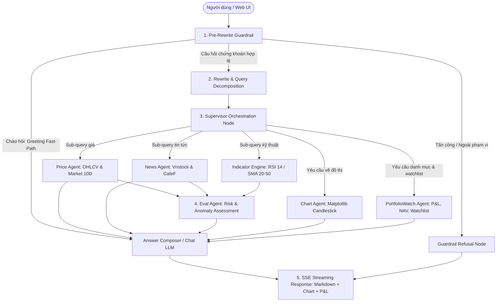

# VN Stock Swarm — Multi-Agent Stock Assistant & Portfolio Watch

Hệ thống trợ lý phân tích chứng khoán Việt Nam và quản lý danh mục đầu tư đa người dùng (Multi-tenant Portfolio Watch) ứng dụng kiến trúc **Multi-Agent Swarm (LangGraph)**, phát triển theo phương pháp **Spec-Driven Development (SDD)**.

---

## 1. App Idea & Mục Tiêu Dự Án

Dự án cung cấp một hệ thống Swarm Multi-Agent thông minh, hỗ trợ nhà đầu tư cá nhân trên thị trường chứng khoán Việt Nam:

1. **Thỏa Mãn 100% Độ Chính Xác Bộ Dữ Liệu `golden_v6_comprehensive.yaml`**:
   - Bao phủ 10 lát cắt chuẩn hóa: Tra cứu giá (`lookup`), Tin tức doanh nghiệp (`news`), Phân tích kỹ thuật RSI/SMA (`indicator`), So sánh đa mã (`comparison`), Quản lý danh mục P&L/NAV (`portfolio`), Danh mục theo dõi & cảnh báo (`watchlist`), Biểu đồ nến kỹ thuật (`chart`), Từ chối câu hỏi ngoài lề (`out_of_scope`), Chặn 100% tấn công can thiệp (`injection`), và Khuyến cáo rủi ro trung lập (`disclaimer`).
2. **Cơ Chế Nối Thẳng Câu Chào Hỏi (Direct Greeting Fast-Path)**:
   - Các câu chào hỏi thân thiện ("Xin chào", "Chào bạn", "Hello", "Hi bot") được Guardrail nhận diện an toàn và **nối thẳng** tới Chat LLM/Composer để phản hồi chào mừng tức thì, hướng dẫn các tính năng chính và gợi ý câu hỏi mẫu — thay vì bị từ chối do ngoài phạm vi hay bị ép tra cứu giá lỗi.
3. **Quản Lý Danh Mục Đa Tài Khoản (Multi-tenant Portfolio)**:
   - Phân tách dữ liệu danh mục nắm giữ, tính toán Unrealized P&L (VND & %) và tổng NAV độc lập cho từng người dùng (`User A`, `User B`, `Default`).
4. **Trực Quan Hóa Đồ Thị Swarm & Streaming Thời Gian Thực**:
   - Streaming Markdown qua Server-Sent Events (SSE).
   - Đồ thị Live Agent Graph phản ánh sinh động trạng thái các Agent theo thời gian thực (hover xem System Prompt và dữ liệu I/O).

---

## 2. Kiến Trúc Multi-Agent Swarm



---

## 3. Danh Mục Tính Năng (Feature Inventory)

| Phân hệ / Chức năng | Mô tả chi tiết | Module / Agent phụ trách |
| :--- | :--- | :--- |
| **0. Luồng Chào Hỏi (Fast-Path)** | Nhận diện câu chào ("Xin chào", "Chào bạn", "Hello"), nối thẳng tới Chat LLM phản hồi thân thiện, bỏ qua Worker tra cứu. | `InputGuardrail`, `AnswerComposer` |
| **1. Tra cứu giá & thị trường** | Tra cứu giá khớp lệnh, % biến động, trần/sàn, lịch sử giá 10 phiên; fallback dữ liệu mẫu khi sàn đóng cửa. | `PriceAgent`, `VnstockPriceSource` |
| **2. Bảng theo dõi Market Matrix 10D**| Endpoint `/api/v1/market/matrix-10d` cung cấp ma trận giá kèm sparklines cho top cổ phiếu VN30. | `MarketService`, `MarketRouter` |
| **3. Tổng hợp tin tức tài chính** | Cào và tổng hợp tin tức nóng từ Vnstock News & CafeF, trích dẫn nguồn minh bạch. | `NewsAgent`, `CafefNewsSource` |
| **4. Chỉ báo kỹ thuật định lượng** | Tính toán RSI(14) (vùng quá mua >70, quá bán <30), SMA(20), SMA(50), tín hiệu Golden/Death Cross. | `TechnicalIndicatorService` |
| **5. Đánh giá rủi ro & bất thường** | Phân loại rủi ro (`none`, `low`, `medium`, `high`) kết hợp từ chỉ báo kỹ thuật và tin tức. | `EvalAgent` |
| **6. Phân rã câu hỏi đa ý (Decomposition)** | Tự động phân rã câu hỏi so sánh đa mã (FPT vs HPG) thành 2 sub-queries độc lập để thu thập đủ dữ liệu. | `RewriteBrain`, `supervisor_agent.nodes` |
| **7. Quản lý danh mục & P&L** | Lưu trữ số lượng, giá vốn, tự động tính Unrealized P&L (VND & %) và tổng NAV theo từng `user_id`. | `PortfolioWatchAgent`, `PortfolioService` |
| **8. Danh mục theo dõi & Cảnh báo** | Thêm/bớt mã theo dõi, cấu hình ngưỡng cảnh báo biến động (`alert_threshold_pct`) cho từng user. | `PortfolioWatchAgent`, `WatchlistStore` |
| **9. Vẽ biểu đồ nến & đồ thị giá** | Tự động sinh biểu đồ nến kỹ thuật kèm SMA qua Matplotlib, nhúng URL ảnh tĩnh hiển thị trong chat. | `ChartAgent` |
| **10. Tường lửa an toàn (Guardrails)** | Chặn 100% Prompt Injection, từ chối câu hỏi ngoài phạm vi, đính kèm miễn trừ trách nhiệm đầu tư trung lập. | `PreRewriteGuardrail`, `AnswerComposer` |
| **11. Web UI & Live Agent Graph** | Giao diện Chat Markdown streaming (SSE), đồ thị Live Agent Graph cập nhật thời gian thực, bảng P&L và User Switcher. | `src/frontend/`, `src/backend/main.py` |

---

## 4. Hồ Sơ Spec-Driven Development (SDD)

Bộ tài liệu đặc tả được duy trì tại thư mục `specs/`:
* [specs/product-spec.md](specs/product-spec.md): Mục tiêu app, Core User Flow, danh mục tính năng in-scope/out-of-scope, 9 Tiêu chí nghiệm thu (Acceptance Criteria).
* [specs/implementation-plan.md](specs/implementation-plan.md): Kế hoạch triển khai chia thành 5 phase nhỏ gọn, chi tiết checklist từng bước.
* [specs/test-plan.md](specs/test-plan.md): Kế hoạch kiểm thử 4 lớp (Unit test, Đánh giá Golden Dataset v6, Đo lường định lượng và Kịch bản Demo 10 bước).
* [specs/change-log.md](specs/change-log.md): Nhật ký chi tiết tiến trình cập nhật và kết quả kiểm thử.
* [AGENTS.md](AGENTS.md): Bản quy tắc ứng xử bắt buộc dành cho AI Coding Assistant.

---

## 5. Hướng Dẫn Cài Đặt & Chạy Cục Bộ (Local Run Guide)

### Yêu Cầu Môi Trường
* Python $\ge$ 3.10 (khuyến nghị Python 3.11 hoặc 3.12)
* SQLite 3
* Git

### Cài Đặt Ban Đầu
```bash
# 1. Khởi tạo và kích hoạt virtual environment
# Windows (PowerShell):
py -m venv $HOME\.venv
& "$HOME\.venv\Scripts\Activate.ps1"

# Linux / macOS (Bash):
python3 -m venv ~/.venv
source ~/.venv/bin/activate

# 2. Cài đặt dependencies
pip install -U pip setuptools wheel
pip install -e ".[dev]"

# 3. Tạo file cấu hình môi trường
# Windows (PowerShell):
Copy-Item .env.example .env

# Linux / macOS:
cp .env.example .env
```

### Chạy Nhanh Bằng Script Tự Động (Khuyến Nghị)

* **Trên Windows (PowerShell):**
  ```powershell
  .\scripts\run_local.ps1
  ```

* **Trên Linux / macOS (Bash):**
  ```bash
  chmod +x ./scripts/run_local.sh
  ./scripts/run_local.sh
  ```

### Chạy Thủ Công Qua Uvicorn
```bash
# Windows (PowerShell):
$env:PYTHONPATH="src"
python -m uvicorn backend.main:app --host 127.0.0.1 --port 8000 --reload

# Linux / macOS (Bash):
export PYTHONPATH="src"
python -m uvicorn backend.main:app --host 127.0.0.1 --port 8000 --reload
```

* **Giao diện Web App UI:** `http://localhost:8000`
* **Tài liệu API (Swagger UI):** `http://localhost:8000/docs`
* **Kiểm tra trạng thái (Health Check):** `http://localhost:8000/health`

### Vận Hành Bằng Docker Compose
```bash
# Build các image dịch vụ
docker compose build

# Khởi động toàn bộ dịch vụ (Backend + Nginx Frontend)
docker compose up -d

# Xem log backend
docker compose logs -f backend

# Dừng các container
docker compose down
```

* **Giao diện Web App qua Docker Nginx:** `http://localhost:3001`

---

## 6. Hướng Dẫn Demo Bằng ngrok (Demo with ngrok)

Để chia sẻ bản demo cục bộ ra internet phục vụ kiểm thử từ xa:

```bash
# 1. Khởi động ứng dụng cục bộ tại port 8000
.\scripts\run_local.ps1

# 2. Mở cửa sổ Terminal mới và kích hoạt tunnel ngrok
ngrok http 8000
```

Sau khi chạy, ngrok sẽ cung cấp một đường link công khai an toàn dạng:
```
Forwarding: https://xxxx-xx-xx-xx.ngrok-free.app -> http://localhost:8000
```
Người dùng hoặc đối tác có thể mở liên kết HTTPS trên để trải nghiệm đầy đủ giao diện Web App, Chat SSE và Live Agent Graph từ bất kỳ thiết bị nào.

---

## 7. Kiểm Thử, Đánh Giá & Benchmark Chi Phí

```bash
# 1. Chạy toàn bộ test suite kiểm thử đơn vị & tích hợp (291 tests)
pytest tests/ -v

# 2. Chạy đánh giá tự động trên tập Golden Dataset v6 (20 test cases, 10 lát cắt)
python -m backend.eval.run --dataset specs/eval/golden_v6_comprehensive.yaml --json specs/eval/eval_summary_v6.json --report specs/eval/eval_summary_v6.md

# 3. Chạy đo lường Cost Baseline trên tập Replay FAQ 200 câu (Hands-on M3-B3 & B6)
PYTHONPATH=src python scripts/cost_baseline.py --dry-run

# 4. Chạy Benchmark Cache 2 tầng (Exact Hash + Semantic Cosine >= 0.93)
PYTHONPATH=src python scripts/cache_benchmark.py --dry-run
```

### Bảng So Sánh Hiệu Quả 2-Tier Caching (Tập Replay 200 Câu FAQ):

| Chế độ Cache | Số lượt gọi LLM | Tổng Tokens | Chi phí (USD) | Lượt Cache Hit | Hit Rate | Mức tiết kiệm |
| :--- | :---: | :---: | :---: | :---: | :---: | :---: |
| **Không cache (Baseline)** | 600 | 623,940 | $0.131364 | 0 | 0.0% | — |
| **Chỉ tầng 1 (Exact)** | 1,200 (2 pass) | 623,940 | $0.131364 | 600 | 50.0% | Tiết kiệm khi lặp lại |
| **Tầng 1 & 2 (Exact + Semantic)** | 600 | 436,740 | $0.091944 | 180 | 30.0% | **Tiết kiệm 30.0% tổng chi phí** |

*Audit 10 mẫu Semantic Cache hit:* Xác nhận **0 false hit** (độ tương đồng Cosine $\ge 0.93$).

### Các Báo Cáo Đo Lường & Đánh Giá Đã Xuất Bản:
* **Bảng Đánh Giá Chi Tiết Golden v5 + v6 (60 câu hỏi - Excel):** [resources/eval/danh_gia_chi_tiet_golden_v5_v6.xlsx](resources/eval/danh_gia_chi_tiet_golden_v5_v6.xlsx) (59/60 PASS - 98.3%, có đủ giá USD, VNĐ, tokens, latency và trace).
* **Báo Cáo Benchmark Cache 2 Tầng (200 câu FAQ):** [specs/eval/cache_benchmark.md](specs/eval/cache_benchmark.md) (Tỷ lệ trúng cache 30.0%, tiết kiệm 30.0% chi phí).
* **Báo Cáo Baseline Chi Phí Gọi LLM:** [specs/eval/cost_baseline.md](specs/eval/cost_baseline.md).
* **Báo Cáo Đánh Giá Golden Dataset v6:** [specs/eval/eval_summary_v6.md](specs/eval/eval_summary_v6.md).

