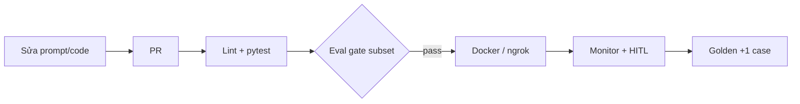

# Portfolio Watch — Multi-Agent Stock Swarm (Production LLMOps Edition)

Ứng dụng web **Multi-Agent Swarm** theo dõi và phân tích cổ phiếu Việt Nam, nâng cấp theo **Module III — Production LLMOps** (*LLM-Engineer-Handbook/module-3-production-llmops.md*) và quy trình **Spec-Driven Development**.

> **Chú thích:** Chu kỳ M3 biến app "chạy được local" thành app "vận hành được production" — prompt versioned, eval gate, cost tracking, CI/CD, observability. MVP vẫn ưu tiên đơn giản (ngrok demo, cache in-memory, git-based registry).

---

## Tính Năng Cốt Lõi

| Tính năng | Mô tả | Handbook M3 |
| :--- | :--- | :---: |
| Multi-Agent Swarm | guardrail → supervisor → price/news/chart → composer | M2 + M3-B7 |
| SSE Streaming Chat | Token realtime + Live Swarm Inspector | M3-B4 |
| Prompt Registry | `resources/prompts/` git-based, alias `production` | M3-B1 |
| Golden Eval Pipeline | 40 cases, 7 slices, LLM-as-judge | M3-B2 |
| Guardrails | Injection + out-of-scope fail-closed | M3-B7 |
| HITL Feedback | Telemetry → feedback loop golden set | M3-B8 |
| Docker 2-container | Frontend :3000 + Backend :8000 | M3-B4 |
| CI eval gate + cost dashboard | GitHub Actions, Langfuse cost script | M3-B6, B7 |
| *(Planned M3)* | Cache 2 tầng semantic/exact | M3-B3 |

---

## Mapping Handbook → Project

| Hands-on Module III | Trạng thái | Vị trí code/spec |
| :--- | :---: | :--- |
| B1 Prompt registry | 🟡 Cơ bản | `resources/prompts/`, `infra/llm/prompt_registry.py` |
| B2 Eval pipeline | 🟡 Cơ bản | `backend/eval/`, `golden_v5.yaml` |
| B3 Cache 2 tầng | 🔴 Planned | Phase 3 — `infra/cache/` |
| B4 Docker + SSE | 🟢 Có | `docker-compose.yml`, `chat.py` |
| B5 Deploy + secrets | 🟡 ngrok OK | README § ngrok; GCP Phase 5 |
| B6 CI/CD eval gate | 🟢 Có | `.github/workflows/ci.yml`, `eval-gate.yml` |
| B7 Observability | 🟢 Có | `infra/monitoring/tracing.py`, `scripts/cost_dashboard.py` |
| B8 Capstone pipeline | 🟡 Spec | `specs/`, HITL → golden draft |

Chi tiết acceptance criteria: [specs/product-spec.md](specs/product-spec.md)

---

## Cấu Trúc Dự Án

```text
llm-backend-ref-portfolio-watch/
├── README.md
├── AGENTS.md
├── specs/                        # Spec-Driven Development
│   ├── product-spec.md           # MVP × Module III (có chú thích handbook)
│   ├── implementation-plan.md    # Phase 0–8 theo 8 bài M3
│   ├── test-plan.md
│   └── change-log.md
├── resources/                    # ROOT — ngang cấp src/
│   ├── prompts/                  # M3-B1: git-based prompt registry
│   ├── eval/                     # M3-B2: golden_v5.yaml, baselines
│   └── data/                     # DB, charts, hitl_feedback.json
├── src/
│   ├── backend/                  # FastAPI + LangGraph swarm (:8000)
│   └── frontend/                 # SPA + Nginx (:3000)
├── tests/                        # ≤ 10 files
└── docker-compose.yml
```

---

## Phát Triển Local

Hướng dẫn chạy app trên máy dev (không Docker). Backend **tự phục vụ SPA frontend** tại cùng cổng `:8000` — không cần process frontend riêng cho luồng dev đơn giản nhất.

### Prerequisites

| Yêu cầu | Ghi chú |
| :--- | :--- |
| **Python ≥ 3.10** | Khuyến nghị **3.12** (khớp CI/Docker) |
| **Git** | Clone repo |
| **Docker Desktop** *(tùy chọn)* | Chỉ cần nếu chạy `docker compose` |
| **OpenAI API key** *(tùy chọn)* | Không có key → heuristic fallback (chat vẫn chạy, chất lượng thấp hơn) |

### Cài đặt

```bash
# 1. Clone & vào thư mục project
cd llm-backend-ref-portfolio-watch

# 2. Virtual environment
python -m venv .venv
# Windows PowerShell:
.\.venv\Scripts\Activate.ps1
# Windows Git Bash / macOS / Linux:
source .venv/bin/activate

# 3. Dependencies
python -m pip install -U pip setuptools wheel
pip install -e ".[dev]"

# 4. Environment file
cp .env.example .env
# Sửa .env: điền OPENAI_API_KEYS nếu dùng OpenAI thật
```

**Windows — `PYTHONPATH`:** Một số lệnh CLI cần:

```bash
# Git Bash / macOS / Linux
export PYTHONPATH=src

# PowerShell
$env:PYTHONPATH = "src"
```

### Biến môi trường

Copy từ [`.env.example`](.env.example). Các biến thường dùng khi dev local:

| Biến | Mặc định | Ý nghĩa |
| :--- | :--- | :--- |
| `LLM_BACKEND` | `openai` | `openai` \| `ollama` \| `vllm` |
| `OPENAI_API_KEYS` | — | API key OpenAI; **để trống** → heuristic fallback |
| `LLM_MODEL` | `gpt-4o-mini` | Model chat/eval |
| `LLM_BASE_URL` | *(auto)* | Override khi dùng Ollama/vLLM |
| `API_HOST` | `127.0.0.1` | Bind address uvicorn local |
| `API_PORT` | `8000` | Cổng backend |
| `SQLITE_PATH` | `./data/portfolio_watch.db` | DB session/chat (local) |
| `BACKEND_SQLITE_PATH` | `./data/backend_store.db` | DB watchlist/approvals |
| `MONITORING_ENABLED` | `false` | Bật Langfuse tracing |
| `LANGFUSE_PUBLIC_KEY` / `LANGFUSE_SECRET_KEY` | — | Chỉ khi `MONITORING_ENABLED=true` |
| `HITL_FEEDBACK_JSON_PATH` | `resources/data/hitl_feedback.json` | Override path telemetry HITL |

> **Lưu ý:** Không commit file `.env` hoặc API key thật vào git.

### Chạy backend (khuyến nghị — gồm cả Web UI)

Backend mount static SPA từ `src/frontend/` — **một lệnh** là đủ UI + API:

```bash
uvicorn backend.main:app --app-dir src --reload --host 127.0.0.1 --port 8000
```

Hoặc dùng `PYTHONPATH`:

```bash
PYTHONPATH=src uvicorn backend.main:app --reload --host 127.0.0.1 --port 8000
```

### Chạy frontend riêng (tùy chọn)

Chỉ cần khi muốn mô phỏng production 2-container (Nginx `:3000` → backend `:8000`):

**Cách A — Docker frontend + backend local:**

```bash
# Terminal 1: backend local
uvicorn backend.main:app --app-dir src --reload --host 127.0.0.1 --port 8000

# Terminal 2: chỉ frontend container (cần backend reachable)
docker compose up frontend --build
```

**Cách B — Full stack Docker** (xem mục [Docker Deploy](#docker-deploy) bên dưới).

Dev đơn giản: dùng **backend-only** tại `:8000` — không cần frontend riêng.

### Local URLs

| Mục | URL (backend-only local) | URL (Docker 2-container) |
| :--- | :--- | :--- |
| **Web UI (chat, inspector)** | http://localhost:8000/ | http://localhost:3000/ |
| **Swagger / OpenAPI** | http://localhost:8000/docs | http://localhost:8000/docs |
| **Health check** | http://localhost:8000/health | http://localhost:8000/health |
| **SSE stream** | http://localhost:8000/api/v1/chat/stream | http://localhost:3000/api/v1/chat/stream |

### Kiểm tra nhanh sau khi chạy

```bash
curl http://localhost:8000/health
python deploy/smoke.py --url http://localhost:8000
PYTHONPATH=src pytest tests/ -q
```

### Troubleshooting

| Triệu chứng | Nguyên nhân / cách xử lý |
| :--- | :--- |
| `ModuleNotFoundError: No module named 'backend'` | Thiếu `--app-dir src` hoặc `PYTHONPATH=src` |
| Chat trả lời generic / không gọi LLM | `OPENAI_API_KEYS` trống → đang dùng heuristic; điền key trong `.env` |
| `422` khi POST `/chat` | Payload thiếu `question`; xem Swagger `/docs` |
| Port 8000 đã dùng | Đổi `API_PORT` trong `.env` hoặc `--port 8001` |
| Docker backend `unhealthy` | `docker compose logs backend`; kiểm tra `.env` và volume `pw_data` |
| SSE không stream trên `:3000` | Dùng Docker frontend (nginx `proxy_buffering off`); hoặc test trực tiếp `:8000` |
| `UnicodeEncodeError` trên Windows console | Chạy `chcp 65001` hoặc `$env:PYTHONIOENCODING="utf-8"` |
| Langfuse không có trace | `MONITORING_ENABLED=true` + đủ `LANGFUSE_*` keys, restart process |
| Eval/script lỗi import | Luôn set `PYTHONPATH=src` trước `python -m backend.*` |

---

## Docker Deploy

Khuyến nghị cho demo ổn định và gần production (2 container: Nginx frontend + FastAPI backend).

```bash
cp .env.example .env
# Điền OPENAI_API_KEYS=sk-... (hoặc để trống → heuristic fallback)

docker compose up --build -d
```

| Dịch vụ | URL |
| :--- | :--- |
| Web UI (Nginx) | http://localhost:3000 |
| Backend API + Swagger | http://localhost:8000/docs |
| Health | http://localhost:8000/health |

```bash
# Logs
docker compose logs -f
docker compose logs -f backend

# Chạy test trong container (service `app` dùng profile `test`)
docker compose --profile test run --rm app pytest tests/ -v

# Dừng
docker compose down
```

**Smoke test sau deploy:**

```bash
python deploy/smoke.py --url http://localhost:8000
python deploy/smoke.py --url http://localhost:3000
python deploy/smoke.py --url http://localhost:8000 --stream
```

---

## Demo Public URL (M3-B5 MVP — ngrok)

> **Chú thích Handbook:** Production dùng GCP + Secret Manager + nginx HTTPS. MVP học tập dùng ngrok — đủ demo streaming SSE ra internet.

```bash
# 1. Cài ngrok: https://ngrok.com/
ngrok config add-authtoken <YOUR_NGROK_AUTHTOKEN>

# 2. Docker đang chạy → expose frontend
ngrok http 3000

# Hoặc backend standalone
ngrok http 8000
```

Mở URL HTTPS ngrok cung cấp — chat streaming hoạt động qua reverse proxy.

### Smoke Testing

Sử dụng script smoke để kiểm tra nhanh dịch vụ Backend sau khi deploy hoặc ngrok:

```bash
python deploy/smoke.py --url http://localhost:8000
# ngrok http 3000 then smoke with ngrok URL
python deploy/smoke.py --url https://<ngrok-url>
```


---

## Kiểm Thử & Eval (M3-B2)

```bash
# Unit tests (mock LLM — CI luôn chạy)
pytest tests/ -v

# Full golden eval 40 cases + dẫn chứng
python -m backend.eval.run_detailed

# Slice bảo mật Zero-Tolerance
python -m backend.eval.run --slice injection

# Trong Docker
docker compose --profile test run --rm app pytest tests/ -v
docker compose --profile test run --rm app python -m backend.eval.run_detailed
```

Dẫn chứng: [specs/eval/eval_results_golden_v5.md](specs/eval/eval_results_golden_v5.md) · [specs/eval/v5_baseline.json](specs/eval/v5_baseline.json)

```bash
# Eval gate (chặn merge khi slice tụt)
PYTHONPATH=src python -m backend.eval.gate --run specs/eval/v5_baseline.json
```

## CI/CD & Branch Protection

Quy trình tích hợp liên tục (CI) và kiểm thử đầu cổng (Eval Gate) theo chuẩn **Module III — B6**.

- **ci.yml**: Chạy trên mọi PR và push lên `main`. Công việc: cài dependencies, lint prompt (`prompt_lint.py`), chạy unit test (`pytest`). Không gọi API LLM thật, không cần secrets.
- **eval-gate.yml**: Chạy tự động *chỉ* trên các PR có thay đổi đường dẫn quan trọng (`resources/prompts/**`, `src/backend/**`, `resources/eval/**`).
  - Cache response bằng GitHub Actions Cache (key băm theo file `resources/prompts/`) để tối ưu thời gian.
  - Chạy eval subset (~20 cases) bằng OpenAI GPT-4o-mini và chặn merge (exit 1) nếu điểm rớt qua ngưỡng hoặc slice bảo mật fail.
  - Upload `pr_report.json` và `pr_report.md` làm artifact để review thủ công.

**Branch Protection (Khuyến nghị)**: Trong cài đặt repository GitHub, bật rules cho nhánh `main`:
- Require status checks to pass before merging: đánh dấu bắt buộc cho các job `test` (trong ci.yml) và `eval_gate` (trong eval-gate.yml).

**Secret Yêu Cầu**: Cần cấu hình Repository Secret: `OPENAI_API_KEYS` chứa API key thật.

**Drill (Diễn tập Eval Gate)**:
Sử dụng script để mô phỏng một lần sửa prompt bị hỏng guardrail và xem gate báo đỏ:
```bash
python scripts/eval_gate_drill.py
```

---

## Quy Trình Spec-Driven (Module III)

1. Đọc [specs/product-spec.md](specs/product-spec.md) — mục tiêu + acceptance criteria M3.
2. Mở **một Phase** trong [specs/implementation-plan.md](specs/implementation-plan.md).
3. Triển khai → test theo [specs/test-plan.md](specs/test-plan.md).
4. Ghi [specs/change-log.md](specs/change-log.md).
5. Tuân [AGENTS.md](AGENTS.md) khi dùng Cursor Agent.

**Trạng thái hiện tại:** Phase 1–14 trong [specs/implementation-plan.md](specs/implementation-plan.md) đã hoàn thành.

---

## Pipeline Production (M3-B8 — Mục Tiêu Capstone)



Pipeline diagram chi tiết: [resources/docs/m3-production-pipeline.md](resources/docs/m3-production-pipeline.md)

---

## Tài Liệu Tham Khảo

- Handbook: `LLM-Engineer-Handbook/module-3-production-llmops.md`
- Hướng dẫn SDD: [Spec Driven Development Guide - Vietnamese.md](Spec%20Driven%20Development%20Guide%20-%20Vietnamese.md)
