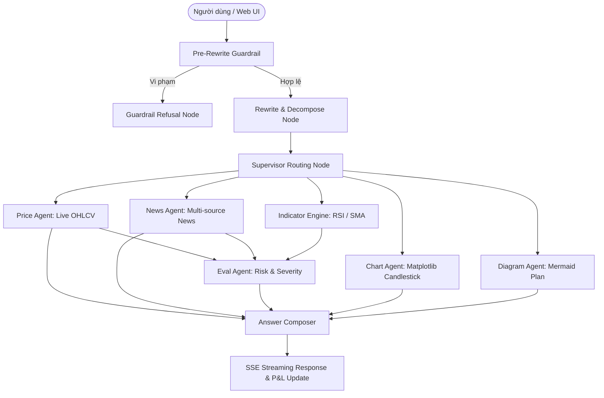

# Portfolio Watch & Management — Multi-Agent Stock Assistant (MVP 2.0)

Ứng dụng web Multi-Agent Swarm quản lý danh mục đầu tư, phân tích cổ phiếu Việt Nam và đánh giá định lượng hệ thống theo phương pháp **Spec-Driven Development** (SDD).

---

## 1. Mục Tiêu Dự Án (MVP 2.0 Goals)

1. **Đa Người Dùng (Multi-tenant Isolation):** Mỗi người dùng sở hữu danh mục theo dõi (Watchlist) và ngưỡng cảnh báo biến động (`alert_threshold_pct`) riêng biệt, dữ liệu phân tách an toàn trong SQLite.
2. **Quản Lý Danh Mục & Lãi/Lỗ Thực Tế (Portfolio P&L Tracking):** Chuyển dịch từ việc "chỉ tra cứu/cảnh báo" sang "quản lý danh mục đầu tư", theo dõi số lượng cổ phiếu nắm giữ, giá vốn mua vào, tính toán Unrealized P&L, tỷ suất lợi nhuận (%) và tổng tài sản ròng (NAV).
3. **Nâng Cấp EvalAgent Với Chỉ Báo Kỹ Thuật & Đa Nguồn Tin:** Tích hợp chỉ báo kỹ thuật định lượng (RSI 14, SMA 20, SMA 50, Golden Cross / Death Cross) và tin tức đa nguồn (Vnstock News, CafeF, Vietstock) để đánh giá mức độ bất thường và rủi ro chính xác, có cơ sở.
4. **Rewrite & Query Decomposition (Multi-Subquery Processing):** Tích hợp kỹ thuật phân rã câu hỏi vào quy trình Rewrite, hỗ trợ xử lý mượt mà các câu hỏi phức tạp, so sánh đa mã bằng cách chia nhỏ thành danh sách `sub_questions` độc lập và điều phối các worker xử lý đầy đủ, không bỏ sót thông tin.
5. **Agent Evaluation Framework (`agent_eval.py`):** Bộ công cụ đánh giá tự động đo lường chất lượng của Swarm Agent: độ chính xác routing của Supervisor, chất lượng phân rã câu hỏi (Decomposition), tính trung thực chống hallucination của AnswerComposer và tỷ lệ hoàn thành tác vụ.

---

## 2. Cấu Trúc Tài Liệu Spec-Driven Development

Bộ tài liệu kỹ thuật được chuẩn hóa và quản lý tập trung:
- [`README.md`](README.md): Tổng quan dự án, hướng dẫn cài đặt, chạy cục bộ, kiểm thử và demo ngrok.
- [`AGENTS.md`](AGENTS.md): Quy tắc hành xử nghiêm ngặt cho AI Coding Agent khi tham gia phát triển dự án.
- [`specs/product-spec.md`](specs/product-spec.md): Đặc tả sản phẩm, người dùng mục tiêu, phạm vi in/out of scope và tiêu chí nghiệm thu (Acceptance Criteria).
- [`specs/implementation-plan.md`](specs/implementation-plan.md): Kế hoạch triển khai 8 Phase bám sát MVP theo từng task nhỏ.
- [`specs/test-plan.md`](specs/test-plan.md): Kế hoạch kiểm thử 3 lớp (Unit/Integration, Feature Acceptance, Agent Evaluation & Regression Gate).
- [`specs/change-log.md`](specs/change-log.md): Nhật ký ghi nhận chi tiết mọi thay đổi và kết quả kiểm thử.

---

## 3. Kiến Trúc Swarm Multi-Agent



---

## 4. Hướng Dẫn Cài Đặt & Chạy Cục Bộ (Local Run)

### Yêu Cầu Tiên Quyết
- Python $\ge$ 3.10
- Môi trường ảo (`venv`)
- Các gói thư viện: `fastapi`, `uvicorn`, `langgraph`, `vnstock`, `pytest`

### Cài Đặt
```bash
# 1. Tạo và kích hoạt virtual environment
python -m venv .venv

# Trên Windows PowerShell:
.venv\Scripts\Activate.ps1

# Trên macOS / Linux:
source .venv/bin/activate

# 2. Cài đặt dependencies
pip install -r requirements.txt
```

### Chạy Backend API Server
```bash
# Chạy với uvicorn tại cổng 8080 (hoặc 8000)
powershell -Command "Set-Item -Path Env:PYTHONPATH -Value 'src'; uvicorn backend.main:app --app-dir src --host 127.0.0.1 --port 8080 --reload"
```
- API Docs: `http://localhost:8080/docs`
- Health check: `http://localhost:8080/health`
- Giao diện Web App: Mở trình duyệt tại `http://localhost:8080` (Backend phục vụ trực tiếp static files frontend).

---

## 5. Hướng Dẫn Kiểm Thử (Testing & Quality Gate)

### 5.1. Chạy Bộ Unit Tests Cốt Lõi (10 Files)
```bash
powershell -Command "Set-Item -Path Env:PYTHONPATH -Value 'src'; pytest tests/ -v"
```
*Yêu cầu nghiệm thu:* 100% test cases PASSED (hiện tại: 139/139 passed).

### 5.2. Chạy Đánh Giá Agent Tự Động (`agent_eval.py`)
```bash
powershell -Command "Set-Item -Path Env:PYTHONPATH -Value 'src'; python scripts/run_agent_eval.py"
```
Đo lường các chỉ số:
- **Routing Accuracy:** Tỷ lệ điều phối đúng worker.
- **Query Decomposition Quality:** Tỷ lệ tách câu hỏi multihop chính xác.
- **Groundedness Score:** Tỷ lệ không bịa đặt số liệu (chống hallucination).

---

## 6. Hướng Dẫn Demo Với ngrok

Để trình diễn web app trực tiếp ra internet:
```bash
# Bước 1: Khởi động backend local (cổng 8080)
uvicorn backend.main:app --app-dir src --port 8080

# Bước 2: Chạy script mở tunnel ngrok tự động
python scripts/start_ngrok_demo.py
```
Script sẽ cung cấp URL Public HTTPS (ví dụ: `https://xxxx.ngrok-free.app`) để người dùng bên ngoài truy cập và trải nghiệm trực tiếp.
