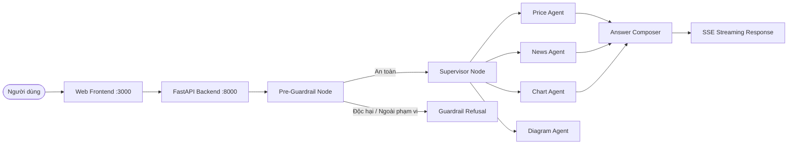

# Portfolio Watch — Multi-Agent Stock Assistant (Production LLMOps Edition)

Ứng dụng web Multi-Agent Swarm theo dõi, phân tích cổ phiếu Việt Nam và tự động kiểm thử toàn diện các câu hỏi, tính năng nghiệp vụ theo phương pháp **Spec-Driven Development**.

---

## 1. Mục Tiêu Dự Án (MVP Goal)

- **End-user:** Chat tra cứu giá, tin tức, biểu đồ cổ phiếu VN với trải nghiệm streaming realtime (SSE), bảo đảm an toàn thông tin (chặn injection, out-of-scope).
- **Hệ thống kiểm thử & QA:** Tự động kiểm thử toàn bộ 40 câu hỏi chuẩn hóa (Golden Dataset v5) thuộc 7 lát cắt nghiệp vụ, phát hiện lỗi phát sinh và tự động sửa chữa nếu có sai lệch.

---

## 2. Cấu Trúc Tài Liệu Spec-Driven Development

Các tài liệu kỹ thuật nằm tại thư mục gốc và thư mục `specs/`:
- [`README.md`](README.md): Tổng quan dự án, hướng dẫn cài đặt và chạy kiểm thử.
- [`AGENTS.md`](AGENTS.md): Quy tắc hành xử bắt buộc cho AI coding agent.
- [`specs/product-spec.md`](specs/product-spec.md): Đặc tả sản phẩm, phạm vi (in/out of scope), tiêu chí nghiệm thu (Acceptance Criteria).
- [`specs/implementation-plan.md`](specs/implementation-plan.md): Kế hoạch triển khai chia theo từng Phase nhỏ.
- [`specs/test-plan.md`](specs/test-plan.md): Kế hoạch kiểm thử tự động, ma trận test 40 câu hỏi và cơ chế regression gate.
- [`specs/change-log.md`](specs/change-log.md): Nhật ký ghi nhận thay đổi và kết quả test từng giai đoạn.

---

## 3. Kiến Trúc Ứng Dụng (Swarm Architecture)



---

## 4. Hướng Dẫn Chạy Cục Bộ (Local Run)

### Yêu Cầu Tiên Quyết
- Python >= 3.10
- Node.js (tùy chọn nếu chạy frontend độc lập) hoặc Docker Compose

### Cài Đặt
```bash
# Cài đặt virtualenv và dependencies
python -m venv .venv
# Kích hoạt trên Windows PowerShell:
.venv\Scripts\Activate.ps1
# Cài đặt gói:
pip install -r requirements.txt # hoặc pip install -e .
```

### Chạy Backend
```bash
uvicorn backend.main:app --app-dir src --reload --host 127.0.0.1 --port 8000
```
- API Docs: `http://localhost:8000/docs`
- Health check: `http://localhost:8000/health`

### Chạy Frontend
```bash
cd src/frontend
python -m http.server 3000
# hoặc mở trực tiếp http://localhost:8000 (backend phục vụ static files)
```

### Chạy Bằng Docker Compose
```bash
docker compose up --build -d
```
- Frontend UI: `http://localhost:3000`
- Backend API: `http://localhost:8000`

---

## 5. Hướng Dẫn Kiểm Thử (Testing)

### Chạy Bộ Kiểm Thử Unit (10 files)
```bash
pytest tests/ -v
```

### Chạy Đánh Giá Toàn Bộ 40 Câu Hỏi (Golden v5)
```bash
PYTHONPATH=src python scripts/run_golden_v5_eval_bundle.py --skip-agent-eval
```

### Kiểm Tra Regression Gate
```bash
python -m backend.eval.gate --run specs/eval/v5_baseline.json
```

---

## 6. Hướng Dẫn Demo Với ngrok

Khi cần chia sẻ bản demo ra internet:
```bash
# Terminal 1: Khởi động backend
uvicorn backend.main:app --app-dir src --port 8000

# Terminal 2: Expose backend qua ngrok
ngrok http 8000
```
Lấy URL HTTPS do ngrok cung cấp để cấu hình API endpoint hoặc trình diễn.
