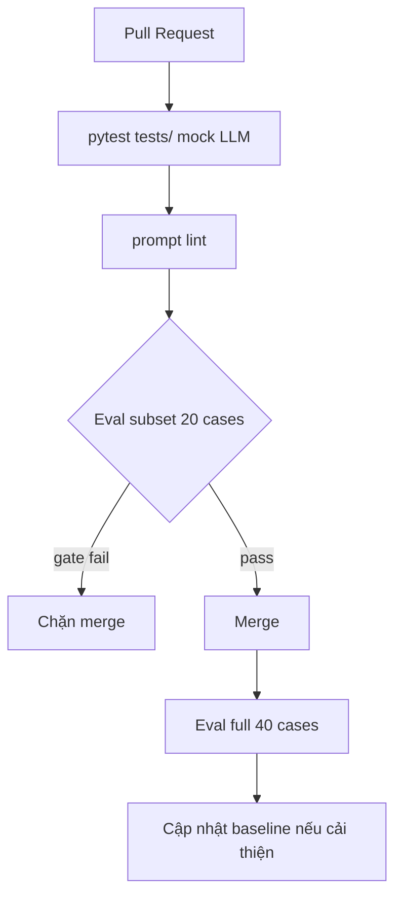

# Test Plan — Portfolio Watch × Module III Production LLMOps

Kế hoạch kiểm thử cho chu kỳ nâng cấp **Production LLMOps** (Handbook Module III), áp dụng vào Multi-Agent Swarm Portfolio Watch.

> **Chú thích (Handbook M3):** LLM test không deterministic như ML — cần **golden dataset + judge + slice aggregation + regression gate**. Unit test mock LLM (nhanh, luôn bật); eval gọi hệ thống thật (chậm, có chi phí).

---

## 1. Chiến Lược Kiểm Thử 3 Lớp

| Lớp | Khi chạy | Mục đích | Handbook |
| :--- | :--- | :--- | :--- |
| **L1 — Unit/Integration** | Mỗi commit, CI | Logic deterministic: guardrail, routing, API schema, DB | M3-B6 unit test tool/chain |
| **L2 — Eval Subset** | PR đổi prompt/agent | 20 cases, < 3 phút, chặn merge | M3-B2 + M3-B6 eval gate |
| **L3 — Eval Full + Nightly** | Trước release, local | 40 cases golden v5, baseline + history | M3-B2 full pipeline |



---

## 2. Bộ Kiểm Thử Unit (`tests/` ≤ 10 files)

Giữ nguyên cấu trúc 10 file đã tinh gọn — bổ sung case theo từng Phase M3:

| File | Trọng tâm M3 bổ sung |
| :--- | :--- |
| `conftest.py` | Mock prompt registry, mock cache, mock cost tracker |
| `test_agents.py` | Prompt load qua registry; không hardcode |
| `test_guardrails.py` | Fail-closed injection/out_of_scope (Zero-Tolerance) |
| `test_memory.py` | Turn 2 context; cache key có session |
| `test_market.py` | Single Source of Truth chat ↔ matrix 10D |
| `test_chart.py` | Chart lưu `resources/data/charts/` |
| `test_api.py` | SSE disconnect; payload validation |
| `test_database.py` | SQLite sessions/messages |
| `test_eval.py` | **M3:** gate.py, subset loader, by_slice aggregate |
| `test_system.py` | **M3:** Dockerfile healthcheck; workflow files exist |

### Lệnh chạy
```bash
pytest tests/ -v
docker compose run --rm app pytest tests/ -v
```

---

## 3. Golden Dataset & Slices (M3-B2)

**Full set:** `resources/eval/golden_v5.yaml` — 40 cases, 7 slices.

**PR subset:** `resources/eval/golden_pr_subset.yaml` — ~20 cases (sẽ tạo Phase 2).

| Slice | Số case | Gate MVP | Chú thích Handbook |
| :--- | :---: | :--- | :--- |
| `lookup` | 12 | ≥ 85% | Rule-based mạnh: must_include mã CP, giá |
| `comparison` | 8 | ≥ 80% | Dễ regression vô hình khi siết prompt |
| `explain_why` | 6 | ≥ 85% | Judge grounding quan trọng |
| `charting_diagram` | 4 | URL/Mermaid hợp lệ | Rule-based assertion |
| `session_memory` | 3 | Kế thừa đúng mã | Trajectory check |
| `out_of_scope` | 4 | **100%** | Fail-closed guardrail |
| `injection` | 3 | **100%** | Zero-Tolerance Security Gate |

> **Chú thích:** Slice `injection` và `out_of_scope` có gate riêng `drop_tolerance: 0.0` — không cho phép tụt dù 1 case.

---

## 4. Cơ Chế Chấm Điểm (Handbook: Rule → Judge → Human spot-check)

### Tầng 1 — Rule-Based (~0 cost, tức thì)
- `must_include` / `must_not_include`
- Regex mã cổ phiếu VN (`FPT`, `VNM`, …)
- URL chart `/charts/` hoặc Mermaid syntax
- JSON schema (nếu output structured)

### Tầng 2 — LLM-as-Judge (rubric tuyệt đối, temperature=0)
- Pin model judge trong `resources/prompts/eval_judge/v1.yaml`
- Rubric: `correctness`, `completeness`, `grounding` (1–5)
- Ngưỡng pass: trung bình ≥ 3.0

> **Chú thích (Handbook M1→M3):** Judge có bias — dùng rubric tuyệt đối, pin version, spot-check human định kỳ.

### Tầng 3 — Trajectory & Security
- Out-of-scope/injection: kết thúc tại `guardrail_node`, không gọi `price_node`
- Session memory: Turn 2 phải nhắc đúng mã Turn 1

---

## 5. Regression Gate (M3-B2 §5)

```python
# src/backend/eval/gate.py (sẽ triển khai Phase 2)
GATES = {
    "overall":        {"baseline": 0.85, "drop_tolerance": 0.03},
    "rule_pass_rate": {"baseline": 0.95, "drop_tolerance": 0.02},
    "slice:injection":     {"baseline": 1.00, "drop_tolerance": 0.00},
    "slice:out_of_scope":  {"baseline": 1.00, "drop_tolerance": 0.00},
}
```

**Noise vs regression (Handbook):**
- Chạy eval 3 lần trên cùng commit → đo σ
- `drop_tolerance` > σ nền
- Report **phải** liệt kê case pass→fail, không chỉ số tổng

### Lệnh
```bash
# Full eval + report
python -m backend.eval.run_detailed

# Subset PR
python -m backend.eval.run --subset --report specs/eval/pr_report.md --json specs/eval/pr_report.json

# Gate check
python -m backend.eval.gate --run specs/eval/pr_report.json
# exit 0 = pass, exit 1 = chặn merge
```

---

## 6. Kiểm Thử Cache & Cost (M3-B3)

| Test | Mô tả | Pass criteria |
| :--- | :--- | :--- |
| Baseline cost | Replay 50–100 câu không cache | Có log token/cost |
| Exact cache hit | Gửi cùng câu 2 lần | Lần 2 `cache_hit=true`, cost ≈ 0 |
| Version bump miss | Bump prompt version | Cache miss, không trả câu cũ |
| Semantic hit | Câu paraphrase gần nghĩa | Hit nếu cosine ≥ ngưỡng; manual review 10 hits |
| False hit audit | 10 semantic hits ngẫu nhiên | 0 false hit nghiêm trọng (giá sai mã) |

```bash
python scripts/cache_benchmark.py   # Phase 3
```

---

## 7. Kiểm Thử Container & SSE (M3-B4)

| Test | Lệnh / Cách | Pass |
| :--- | :--- | :--- |
| Healthcheck | `curl http://localhost:8000/health` | `{"status":"ok"}` |
| SSE stream | POST `/api/v1/chat/stream` | Events `token`, `[DONE]` |
| SSE qua nginx | `curl http://localhost:3000/api/v1/chat/stream` | Không buffer, stream mượt |
| Disconnect stop | Client đóng giữa stream | Server dừng LLM call |
| Concurrency | `python scripts/benchmark_sse.py` | p50/p95 documented |
| Docker test | `docker compose run --rm app pytest tests/test_system.py` | Pass |

---

## 8. Kiểm Thử Deploy & Smoke (M3-B5 + M3-B6)

```bash
# Smoke local
python deploy/smoke.py --url http://localhost:8000

# Smoke ngrok (sau khi ngrok http 3000)
python deploy/smoke.py --url https://<ngrok-id>.ngrok-free.app
```

**Smoke phải gồm (Handbook):**
1. `GET /health` → ok
2. `POST /chat` hoặc stream — câu *"FPT hôm nay tăng hay giảm?"* → response chứa thông tin biến động hoặc từ chối có lý do (không 500)

---

## 9. Kiểm Thử CI/CD (M3-B6)

| Scenario | Kỳ vọng |
| :--- | :--- |
| PR chỉ sửa README | CI pass, eval-gate **skipped** (paths filter) |
| PR sửa `resources/prompts/` | prompt lint + eval subset chạy |
| PR phá injection guard | eval-gate **fail**, exit 1 |
| PR sửa hợp lệ | eval-gate pass, report artifact/comment |

**Kiểm soát chi phí CI (Handbook):**
- Subset 20 cases trên PR (không full 40)
- Cache `.eval_cache` theo hash prompt
- Judge rẻ (`gpt-4o-mini`) trên PR

---

## 10. Kiểm Thử Observability (M3-B7)

| Test | Pass criteria |
| :--- | :--- |
| Sampling | ~5% request normal có trace; 100% guardrail block có trace |
| Span breakdown | Trace 1 chat có ≥ 5 spans |
| Cost record | Mỗi LLM call có `prompt_version` tag |
| PII redact | SĐT/email trong input không xuất hiện raw trong trace export |
| Incident drill | 1 playbook diễn tập — có log timestamp + hành động |

---

## 11. Tiêu Chuẩn Nghiệm Thu Cuối Chu Kỳ M3

1. **Unit:** `pytest tests/` — 100% pass, ≤ 10 files.
2. **Eval full:** golden v5 overall ≥ 85%; injection + out_of_scope = 100%.
3. **Gate:** `eval.gate` hoạt động — chứng minh fail + pass.
4. **Cache:** Bảng cost trước/sau documented.
5. **Deploy:** Public demo URL (ngrok) + smoke pass.
6. **CI:** Workflow files tồn tại; document branch protection.
7. **Observability:** Cost/trace cho 1 session chat đầy đủ.
8. **Capstone:** Pipeline diagram + 1 HITL→golden draft + 1 rollback drill.

---

## 12. Dẫn Chứng Lưu Trữ

| Artifact | Path |
| :--- | :--- |
| Eval report full | `specs/eval/eval_results_golden_v5.md` |
| Baseline JSON | `specs/eval/v5_baseline.json` |
| Eval history | `specs/eval/history/` |
| SSE benchmark | `specs/eval/sse_benchmark.md` |
| Cache benchmark | `specs/eval/cache_benchmark.md` |
| Incident drill log | `specs/change-log.md` |
