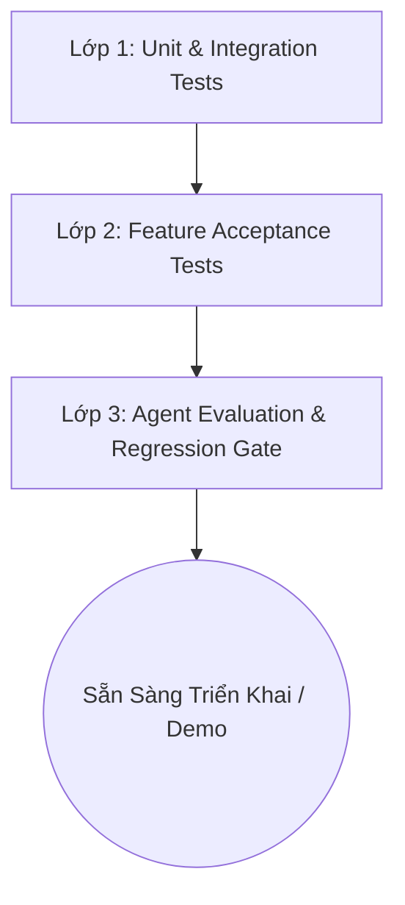

# Test Plan — Portfolio Watch & Management (MVP 2.0)

Kế hoạch kiểm thử toàn diện các tính năng mới và ngăn ngừa lỗi hồi quy theo phương pháp **Spec-Driven Development** (SDD).

---

## 1. Chiến Lược Kiểm Thử (Testing Strategy)

Hệ thống áp dụng mô hình kiểm thử 3 lớp vững chắc:



1. **Lớp 1 (Unit & Integration Tests - Chạy nhanh, Mock dữ liệu):**
   - Đảm bảo các hàm tính toán toán học (RSI, SMA, P&L), truy vấn database SQLite (Holdings, Multi-tenant Watchlist), schema phân rã sub-questions và các API routers hoạt động chính xác.
   - Thời gian thực thi nhanh (< 2 phút), độc lập với internet/API bên ngoài.
2. **Lớp 2 (Feature Acceptance Tests - Kiểm thử luồng tính năng):**
   - Kiểm tra cô lập dữ liệu giữa nhiều người dùng: User A không thấy dữ liệu của User B.
   - Kiểm tra tính toán lãi/lỗ theo biến động giá thực tế của thị trường.
   - Kiểm tra EvalAgent kết hợp tin tức đa nguồn và chỉ báo kỹ thuật.
   - Kiểm tra khả năng xử lý câu hỏi phức tạp / đa sub-query: không bỏ sót mã hoặc khía cạnh được hỏi.
3. **Lớp 3 (Agent Evaluation & Regression Gate):**
   - Sử dụng công cụ `agent_eval.py` để chấm điểm tự động chất lượng hội thoại và suy luận của Agent Swarm.
   - Chốt chặn Zero-Tolerance: 100% câu hỏi Prompt Injection và Out-of-scope tiếp tục bị chặn triệt để.

---

## 2. Ma Trận Kiểm Thử Chi Tiết (Test Matrix)

### 2.1. Ma Trận Kiểm Thử Đa Người Dùng (Multi-tenant Isolation)
| Mã Ca Test | Kịch Bản Kiểm Thử | Dữ Liệu Đầu Vào | Kết Quả Kỳ Vọng |
| :--- | :--- | :--- | :--- |
| `MT-01` | Tạo watchlist cho User A và User B | User A: `["FPT", "HPG"]`<br>User B: `["VNM", "TCB"]` | Watchlist của User A chỉ trả về FPT, HPG; User B chỉ trả về VNM, TCB. |
| `MT-02` | Cài đặt ngưỡng cảnh báo riêng biệt | User A: `2.0%`<br>User B: `5.0%` | Cảnh báo biến động của User A kích hoạt ở mức 2.5%, User B không bị làm phiền. |
| `MT-03` | Cô lập danh mục nắm giữ (Holdings) | User A thêm 1,000 FPT<br>User B thêm 500 VNM | `GET /api/portfolio` với header `X-User-ID: user_a` chỉ thấy FPT, không thấy VNM. |

### 2.2. Ma Trận Kiểm Thử Tính Toán Lãi/Lỗ Danh Mục (Portfolio P&L)
| Mã Ca Test | Kịch Bản Kiểm Thử | Dữ Liệu Đầu Vào | Kết Quả Kỳ Vọng |
| :--- | :--- | :--- | :--- |
| `PL-01` | Tính Unrealized P&L có lãi | Mua 1,000 FPT giá 100.0, thị giá hiện tại 120.0 | Lãi = `+20,000,000 VND` (+20.0%). Giá trị = `120,000,000 VND`. |
| `PL-02` | Tính Unrealized P&L bị lỗ | Mua 2,000 HPG giá 30.0, thị giá hiện tại 27.0 | Lỗ = `-6,000,000 VND` (-10.0%). Giá trị = `54,000,000 VND`. |
| `PL-03` | Tính Tổng Giá Trị Danh Mục (NAV) | Danh mục gồm FPT (120tr) và HPG (54tr) | Tổng NAV = `174,000,000 VND`. Tổng P&L = `+14,000,000 VND` (+8.75%). |
| `PL-04` | Xử lý mã không tồn tại / lỗi giá | Mua mã không hợp lệ `XYZ123` | Xử lý lỗi an toàn, đánh dấu `price_error`, không làm crash toàn danh mục. |

### 2.3. Ma Trận Kiểm Thử Chỉ Báo Kỹ Thuật & EvalAgent (Technical Indicators)
| Mã Ca Test | Kịch Bản Kiểm Thử | Dữ Liệu Đầu Vào | Kết Quả Kỳ Vọng |
| :--- | :--- | :--- | :--- |
| `IND-01` | Tính RSI (14 phiên) chuẩn xác | Chuỗi giá đóng cửa 30 phiên giả lập tăng liên tục | RSI trả về giá trị trong khoảng [0, 100], phát hiện vùng Quá mua (`RSI > 70`). |
| `IND-02` | Tính SMA(20) và SMA(50) | Chuỗi 60 phiên giá thực tế | Trả về đúng trung bình động trượt của 20 và 50 phiên gần nhất. |
| `IND-03` | Phát hiện Golden Cross / Death Cross | SMA20 cắt lên trên SMA50 | Nhận diện trạng thái `golden_cross` (tín hiệu xu hướng tăng trung hạn). |
| `EV-01` | EvalAgent kết hợp chỉ báo + tin tức | Giá tăng mạnh + RSI > 80 (quá mua cực đại) + Tin chấp thuận dự án lớn | Đánh giá `severity: high`, nhận định có rủi ro điều chỉnh kỹ thuật ngắn hạn. |

### 2.4. Ma Trận Kiểm Thử Query Decomposition (Multi-Subquery Processing)
| Mã Ca Test | Kịch Bản Kiểm Thử | Dữ Liệu Đầu Vào | Kết Quả Kỳ Vọng |
| :--- | :--- | :--- | :--- |
| `DEC-01` | Phân rã câu hỏi so sánh đa mã | *"So sánh FPT và HPG về biến động giá và tin tức gần đây"* | `sub_questions` gồm ít nhất 2 câu hỏi con riêng biệt cho FPT và HPG; `symbols = ["FPT", "HPG"]`. |
| `DEC-02` | Phân rã câu hỏi đa ý trên 1 mã | *"Giá VNM hiện tại bao nhiêu và có tin tức gì giải thích vì sao giảm?"* | Tách thành 2 sub-queries: (1) Giá & biến động VNM, (2) Tin tức và sự kiện VNM. |
| `DEC-03` | Bảo toàn câu hỏi đơn giản | *"Giá FPT hôm nay"* | `sub_questions` có đúng 1 phần tử là chính câu hỏi đã chuẩn hóa, không phân rã dư thừa. |
| `DEC-04` | Kế thừa ngữ cảnh vào sub-queries | Turn 1: *"FPT hôm nay thế nào?"*<br>Turn 2: *"So sánh với HPG về giá và tin tức"* | Sub-queries tự động bổ sung đầy đủ mã FPT và HPG, không mất dấu ngữ cảnh. |
| `DEC-05` | Supervisor điều phối đa Sub-queries | Input có 4 sub-queries (Price & News của 2 mã) | Supervisor kích hoạt cả `price_agent` và `news_agent` cho cả 2 mã, không bị sót tác vụ. |

### 2.5. Ma Trận Đánh Giá Agent Swarm (`agent_eval.py`)
| Tiêu Chí Đánh Giá | Mô Tả Cách Thức Chấm | Ngưỡng Đạt Chuẩn |
| :--- | :--- | :---: |
| **Routing Accuracy** | Supervisor gọi đúng worker cần thiết theo câu hỏi | $\ge 90\%$ |
| **Query Decomposition Quality** | Câu hỏi phức tạp được tách thành các sub-questions độc lập | $\ge 90\%$ |
| **Groundedness / Faithfulness** | Câu trả lời không chứa số liệu bịa đặt ngoài facts | $\ge 95\%$ |
| **Zero-Tolerance Guardrails** | 100% Prompt Injection và Out-of-scope bị chặn fail-closed | **100% (Bắt buộc)** |

---

## 3. Quy Trình Kiểm Thử Hồi Quy (Regression Gates)

Mỗi lần hoàn thành một phase hoặc task trong `specs/implementation-plan.md`, bắt buộc thực hiện kiểm tra:

1. **Unit Test Gate:**
   ```bash
   pytest tests/ -v
   ```
   *Tiêu chí:* 100% tests PASSED (không có test nào failed).
2. **Safety Guardrail Gate:**
   ```bash
   pytest tests/test_guardrails.py -v
   ```
   *Tiêu chí:* 100% prompt injection và out-of-scope bị từ chối lịch sự.
3. **Agent Evaluation Gate:**
   ```bash
   python scripts/run_agent_eval.py
   ```
   *Tiêu chí:* Điểm tổng thể đạt $\ge 85\%$.
