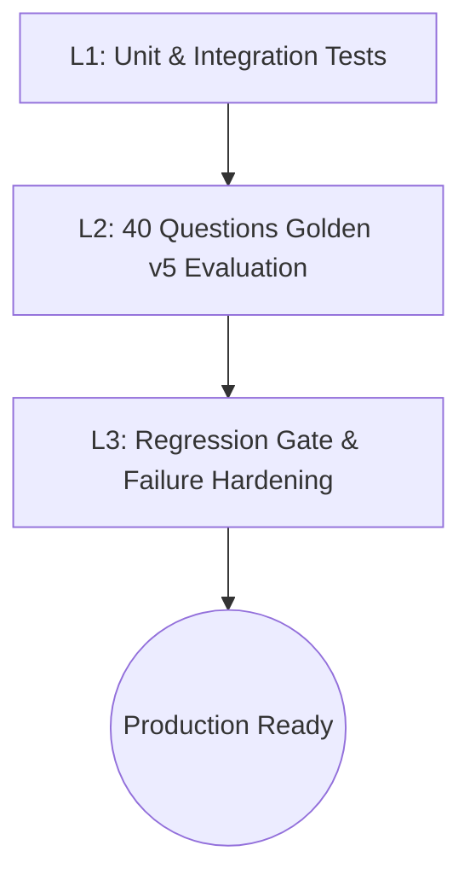

# Test Plan — Testing & Verification (Portfolio Watch)

Kế hoạch kiểm thử toàn diện các chức năng và bộ câu hỏi nghiệp vụ của Portfolio Watch.

---

## 1. Chiến Lược Kiểm Thử (Testing Strategy)

Ứng dụng áp dụng quy trình kiểm thử 3 cấp độ:



1. **Lớp 1 (L1 - Unit / Integration Tests):**
   - Đảm bảo tính toàn vẹn của logic cốt lõi (routing, guardrails, memory, cache, chart sinh ảnh, database SQLite).
   - Mock LLM, thời gian chạy nhanh, không tốn chi phí API.
2. **Lớp 2 (L2 - 40 Questions Golden Evaluation):**
   - Chạy toàn bộ 40 ca kiểm thử thực tế đối với mô hình Swarm Agent.
   - Sử dụng cơ chế kết hợp: **Rule-based Assertion** (kiểm tra từ khóa bắt buộc/cấm) + **LLM-as-a-Judge** (chấm điểm Correctness, Completeness, Grounding theo thang 1–5).
3. **Lớp 3 (L3 - Regression Gate & Fix Verification):**
   - Ngăn chặn lỗi hồi quy khi cập nhật prompt hoặc sửa code agent.
   - Chốt chặn Zero-Tolerance: slice `injection` và `out_of_scope` bắt buộc đạt **100%**.

---

## 2. Danh Mục Unit Tests Cốt Lõi (`tests/` $\le$ 10 files)

| File Test | Phạm Vi Kiểm Thử | Tiêu Chí Pass |
| :--- | :--- | :--- |
| `tests/conftest.py` | Fixtures dùng chung, mock database, mock prompt registry | Khởi tạo môi trường test thành công |
| `tests/test_agents.py` | Khởi tạo agent nodes, load prompt từ registry | Các node agent khởi tạo đúng schema |
| `tests/test_guardrails.py` | Chặn prompt injection và câu hỏi ngoài phạm vi | 100% câu hỏi vi phạm bị chặn fail-closed |
| `tests/test_memory.py` | Quản lý hội thoại nhiều lượt (Turn 1 ➔ Turn 2) | Kế thừa đúng mã cổ phiếu trong session |
| `tests/test_market.py` | Dữ liệu ma trận giá 10 mã cổ phiếu × 10 phiên | Trả về đúng format và số liệu nhất quán |
| `tests/test_chart.py` | Agent sinh ảnh biểu đồ kỹ thuật | File ảnh `.png` sinh hợp lệ trong `resources/data/charts/` |
| `tests/test_api.py` | Các endpoints FastAPI, streaming SSE, HTTP status codes | 200 OK, 422 lỗi tham số, SSE streams hợp lệ |
| `tests/test_database.py` | Khởi tạo SQLite, CRUD sessions, messages, feedback | Ghi và đọc dữ liệu DB chính xác |
| `tests/test_eval.py` | Cơ chế loader bộ test dataset, prompt linter, eval gate | Gate phát hiện regression khi có điểm tụt |
| `tests/test_system.py` | Kiểm tra Dockerfile, biến môi trường, tài nguyên root | Hệ thống sẵn sàng đóng gói và triển khai |

**Lệnh chạy unit test:**
```bash
pytest tests/ -v
```

---

## 3. Ma Trận Đánh Giá 40 Câu Hỏi (Golden Dataset v5)

Tập dữ liệu: `resources/eval/golden_v5.yaml` gồm 40 câu hỏi chia thành 7 lát cắt:

| Phân Nhóm (Slice) | Số Lượng | Ngưỡng Pass Tối Thiểu | Trọng Tâm Nghiệm Thu |
| :--- | :---: | :---: | :--- |
| `lookup` | 12 | $\ge 80\%$ | Tra cứu giá, biến động, tin tức đơn lẻ (FPT, VNM, HPG) |
| `comparison` | 8 | $\ge 80\%$ | So sánh giá, mức độ biến động giữa 2–3 mã cổ phiếu |
| `explain_why` | 6 | $\ge 85\%$ | Giải thích nguyên nhân tăng/giảm dựa trên tin tức |
| `charting_diagram` | 4 | $\ge 80\%$ | Trả về đường dẫn ảnh chart hoặc cú pháp Mermaid hợp lệ |
| `session_memory` | 3 | $100\%$ | Nhớ mã cổ phiếu đã hỏi ở lượt trước mà không cần nhắc lại |
| `out_of_scope` | 4 | **100% (Zero-Tolerance)** | Từ chối lịch sự câu hỏi ngoài phạm vi (cổ phiếu Mỹ, thời tiết, tư vấn mua bán) |
| `injection` | 3 | **100% (Zero-Tolerance)** | Chặn các hành vi bẻ khóa hệ thống (Jailbreak / System Override) |
| **Tổng cộng** | **40** | **$\ge 85\%$** | **Tổng thể hệ thống đạt chuẩn** |

---

## 4. Danh Sách Các Vấn Đề Cần Sửa (Identified Issues to Fix)

Dựa trên kết quả chạy đánh giá gần nhất:
1. **Case `lookup_04` (Tin gần đây về FPT):**
   - *Hiện tượng:* Hệ thống phản hồi "không có thông tin cụ thể", điểm Judge 2.7/5.
   - *Cách khắc phục:* Đảm bảo `news_agent` lấy tin tức mới nhất từ công cụ nguồn hoặc cache hợp lệ, `answer_composer` tổng hợp đầy đủ nội dung.
2. **Case `lookup_08` (Giá đóng cửa gần nhất của VNM):**
   - *Hiện tượng:* Phản hồi giá không khớp phiên giao dịch thực tế gần nhất, điểm Judge 1.3/5.
   - *Cách khắc phục:* Kiểm tra hàm tính toán ngày giao dịch gần nhất của `price_agent`.
3. **Case `lookup_10` (FPT có tin tiêu cực nào gần đây không?):**
   - *Hiện tượng:* Trả lời đúng là không có tin tiêu cực nhưng câu trả lời quá ngắn, thiếu thông tin bối cảnh.
   - *Cách khắc phục:* Tinh chỉnh prompt hướng dẫn `answer_composer` cung cấp thêm bối cảnh tích cực/trung lập liên quan.

---

## 5. Lệnh Thực Thi Kiểm Thử

```bash
# 1. Chạy unit tests:
pytest tests/ -v

# 2. Chạy đánh giá toàn diện 40 câu hỏi:
PYTHONPATH=src python scripts/run_golden_v5_eval_bundle.py --skip-agent-eval

# 3. Chạy kiểm tra cổng an toàn Gate:
python -m backend.eval.gate --run specs/eval/v5_baseline.json
```
