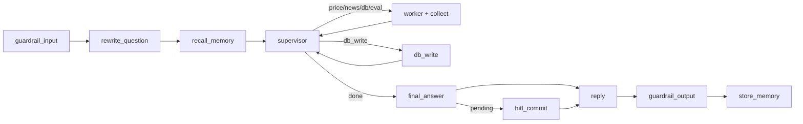

# Brief tạo slide — Hierarchical Supervisor (`agent_pr`)

> Copy toàn bộ file này sang chat khác để dựng deck. Chỉ bám **code hiện tại** trong `app/agent_pr` + `app/api/routes_pr.py`.  
> Không dùng vision cũ (DocumentAgent, Swarm Scout/Render/Api/Stealth, ContentRouter 2 tầng, SynthesisAgent riêng).  
> File HTML `SLIDES.agent_pr.html` là bản deck cũ — nội dung dưới đây đã cập nhật theo kiến trúc mới.
> Cập nhật 2026-09-03: thêm 4 tính năng mới — **Multi-symbol thật, TTL freshness qua prompt, Model routing (final_answer), Trajectory từ tool-call thật**. Xem Slide 4b.

---

## Hướng dẫn cho chat dựng slide

- Ngôn ngữ: tiếng Việt, giọng kỹ thuật rõ, ngắn.
- Mỗi slide: 1 ý chính + ≤5 bullet; ưu tiên sơ đồ / bảng hơn đoạn văn.
- Giữ tên hàm / schema đúng code: `RoutingDecision`, `route_supervisor`, `db_write`, `final_answer_node`, `interrupt_before=["hitl_commit"]`, `_select_final_answer_model`, `extract_tool_trace`.
- Số liệu an toàn để ghi: `recursion_limit=40`, loop detection window = 3 lần `{symbol}:{next_agent}` giống nhau → ép `done`, `AGENT_PR_FRESHNESS_MINUTES=20` (mặc định).
- Không bịa % test pass / cost USD trừ khi có số đo mới — slide “Kết quả” dùng mô tả định tính hoặc để placeholder `[đo lại]`.

**Đề xuất thứ tự deck (~10–11 slide):**  
1 Cover → 2 Kiến trúc graph → 3 Tools map → 4 Decision points → 4b Multi-symbol + TTL + Model routing + Trajectory (mới) → 5 Memory + HITL → 6 Guardrails / cost / eval → 7 Demo script → 8 Ranh giới (chưa build)

---

## Slide 1 — Cover / Mục tiêu

**Eyebrow:** Đồ án cuối khóa · LLM Engineer · `app/agent_pr`

**Title:** Hierarchical Supervisor cho phân tích cổ phiếu Việt Nam

**Lede:** Trả lời câu hỏi tiếng Việt về cổ phiếu niêm yết (giá, tin, nguyên nhân biến động) bằng nhiều nguồn thật (vnstock, CafeF, SQLite) — **không bịa số liệu**, **không COMMIT dữ liệu mới** khi chưa có người duyệt.

**3 số nổi:**

| Số | Ý |
|----|---|
| **4** | Worker ReAct chuyên biệt: giá · tin · DB · đánh giá khớp giá–tin |
| **1** | Hub hỏi LLM **mỗi vòng** để chọn worker + **mã CP** kế tiếp (multi-symbol thật, không plan cố định 1 lần) |
| **0** | Số liệu được phép bịa; ghi DB không qua HITL |

---

## Slide 2 — Kiến trúc tổng quan

**Title:** Một Supervisor hỏi LLM sau mỗi worker — không phải máy trạng thái cố định

**Decision point:** Hub-and-Spoke + **routing động** (mẫu `agent_m2/hierarchical.py`) thay cho coordinator/`_coordinate` nhiều nhánh if-else. Đánh đổi: +1 LLM call/vòng; đổi lại bỏ logic điều kiện cứng khó mở rộng.

**Luồng hub (rút gọn):**

```
guardrail_input
  → rewrite_question → recall_memory → [compact_history?]
  → supervisor ⇄ {price|news|db|eval}_agent (+ *_collect)
              ⇄ db_write
  → final_answer → [hitl_commit?] → reply → guardrail_output → store_memory → END
```

**Mermaid (paste khi dựng slide):**



**Điểm then chốt trên sơ đồ:**

- Mỗi worker xong → `{domain}_collect` gộp vào `notes[symbol][domain]` → quay `supervisor`.
- LLM chọn `done` → `final_answer_node` tổng hợp từ `notes` (**không** còn `synthesis_agent` riêng).
- `db_write` là nhánh hub riêng; `hitl_commit` là điểm **duy nhất** graph interrupt chờ người.

**Ảnh tham chiếu (nếu có):** `images/supervisor_agent_graph.png` (render LangGraph thật).

---

## Slide 3 — Map node & tools

**Title:** Hub structured output · Worker ReAct bind_tools

**Nguyên tắc:** Hub **không** `bind_tools` — dùng `chat_parsed` / structured schema. Chỉ 4 worker (+ `db_write` tái dùng tool DB) thật sự chọn tool qua ReAct + `select_tools()` trên **catalog riêng từng domain**.

### Hub / guard (không ReAct tool)

| Node | Cơ chế | Chi tiết |
|------|--------|----------|
| `guardrail_input` | Function | Injection/toxic → HTTP 400; `in_topic_scope` + `llm_scope_check`; `redact_pii` |
| `rewrite_question` | `RewrittenQuery` | Tách `symbols[]` + câu viết lại tiếng Việt |
| `supervisor` | `RoutingDecision` | Mỗi vòng: `next_agent` ∈ {price_agent, news_agent, db_agent, db_write, eval_agent, done} + `symbol` (mã CP vòng này xử lý — multi-symbol thật) + `reasoning` |
| `final_answer` | `FinalAnswer` | Tổng hợp từ `notes` + `history`; không crawl/ghi DB; **model tự chọn** `gpt-4o`/`gpt-4o-mini` qua `_select_final_answer_model` |
| `hitl_commit` → `guardrail_output` | Interrupt + check | `interrupt_before=["hitl_commit"]`; `sanitize_stock_answer` trước trả user |

### 4 worker (mỗi cái ~3 tool)

| Worker | Nguồn | Tool bắt buộc (IO) | Tool phụ |
|--------|-------|--------------------|----------|
| `price_agent` (`craw_agent`) | vnstock VCI | `fetch_latest_close` (`last=0` = lỗi, không bịa) | `normalize_ticker`, `describe_price_source` |
| `news_agent` | CafeF Ajax | `fetch_cafef_news` (tin thô, **không** sentiment) | `normalize_ticker`, `describe_news_source` |
| `db_agent` | SQLite | `read_symbol_store` (≤5 phiên + tin; đọc = không HITL) | `stage_new_rows` (+ `idempotency_key`), `describe_db_hitl` |
| `eval_agent` | Keyword rules | `score_price_vs_news` | `classify_headline`, `list_eval_keywords` |

### `db_write` (hub node, không phải worker ReAct mới)

- Gọi subgraph `db_agent` `mode="write"` với candidates từ giá/tin vừa crawl.
- Soạn **pending** — chưa COMMIT bảng chính.
- Tool liên quan: `stage_new_rows`, `read_symbol_store` (tránh trùng).

**Pattern lặp:** mỗi worker = 1 tool IO bắt buộc + tool chuẩn hoá/mô tả nguồn.

---

## Slide 4 — Decision points

**Title:** Routing tự do — trừ đúng chỗ có side-effect

### 1) Routing động thay máy trạng thái

- Trước: plan / `_coordinate` nhánh cố định → khó mở rộng.
- Nay: LLM đọc `notes` + `history` mỗi vòng → chọn worker hoặc `done`.
- Giá đơn giản có thể: `price_agent` → `done` (1 worker). Câu “tại sao giảm” tự mở: price → news → eval.

### 2) Ngoại lệ code-cứng: `route_supervisor` ép `db_write`

- Worker **đọc** (price/news/db/eval): LLM quyết định an toàn (không side-effect ghi).
- Nếu LLM chọn `done` nhưng còn giá/tin crawl **chưa** soạn pending → code **ép** `db_write` trước `final_answer`.
- Lý do: không phó mặc bước ghi kho cho routing tự do.

### 3) Tool retrieval theo domain

- `select_tools(query, catalog)` — catalog **riêng** từng worker (Price không thấy `fetch_cafef_news`).
- Không Hierarchical Grouping toàn cục — mỗi catalog đã hẹp.

### 4) Bỏ `synthesis_agent`

- Gộp vào `final_answer_node`: −1 LLM call/turn, −1 lựa chọn routing phải dạy model.
- Đổi lại: tổng hợp không còn subgraph test độc lập.

### 5) Loop detection

- `_looping(agent_history)`: 3 lần liên tiếp cùng `{symbol}:{next_agent}` → ép `done` **trước** khi gọi LLM thêm.
- Lưới cuối: `recursion_limit=40` khi `graph.invoke`.

### 6) Guardrail đúng chỗ vs “vượt khả năng”

- Ngoài domain (“thời tiết Hà Nội”) → chặn sớm / `out_of_scope`.
- Trong domain nhưng vượt khả năng (“mã nào lãi nhiều nhất”) → **không** nhồi vào guardrail; sửa ở **prompt routing** / từ chối rõ trong answer (không bịa ticker mặc định).

---

## Slide 4b — 4 tính năng mới (2026-09-03): Multi-symbol · TTL · Model routing · Trajectory

**Title:** Từ "1 mã / mock trajectory" sang hệ thống thật hỗ trợ nhiều mã, tự biết khi nào đủ dữ liệu, tự chọn model theo độ khó

### 1) Multi-symbol thật — không chỉ từ chối lịch sự

- `state["symbol"]` đổi ý nghĩa: **mã worker VÒNG NÀY xử lý** — supervisor set lại mỗi vòng qua `RoutingDecision.symbol`.
- `state["symbols"]`: toàn bộ mã cần xử lý trong turn. `notes`/`price`/`news`/`db`/`eval` đều là `dict[symbol, X]`.
- Cơ chế: **1 lượt gọi worker = 1 mã** — câu "HPG và FPT mã nào mạnh hơn" → `price_agent(HPG)` → `price_agent(FPT)` → `news_agent(HPG)` → ... không gộp nhiều mã vào 1 lượt.
- Worker **không đổi gì nội bộ** — chỉ hub-wrapper (`price_agent()`, `news_agent()`,...) merge kết quả đơn vào dict theo symbol.
- `db_write` lặp qua **mọi mã** có candidate trong 1 lần chạy node (route_supervisor không tự chọn được symbol cho nhánh ghi).
- Loop detection symbol-aware: `agent_history` dạng `"{symbol}:{next_agent}"` — lặp 3 lần `"HPG:price_agent"` không "lây" chặn oan sang FPT.

### 2) TTL freshness — dạy qua prompt, không code-enforce

- `db_agent` đọc thêm cột `ts` (đã có sẵn trong schema, chỉ chưa lộ ra) → `_freshness_label()` sinh câu "vừa cập nhật (2 phút trước)" / "hơn 1 giờ trước".
- Nhét thẳng vào `detail` của `db_agent` → tự động chảy vào `notes[symbol]["db_agent"]`, không cần sửa `_make_collect_node`.
- `_SUPERVISOR_SYSTEM` dạy: dữ liệu mới hơn `AGENT_PR_FRESHNESS_MINUTES` (mặc định 20 phút) → coi là đủ dùng, không crawl lại — **LLM tự quyết định**, không code chặn cứng.

### 3) Model routing — chỉ áp dụng cho `final_answer_node`

- `_select_final_answer_model(state)`: `gpt-4o` khi ≥2 mã, có từ khoá so sánh/tại sao/phân tích, hoặc ≥3 domain trong notes — còn lại `gpt-4o-mini`.
- Routing/rewrite/sentiment **giữ nguyên** `gpt-4o-mini` — chỉ bước tổng hợp cuối (khó nhất, ít lần gọi nhất/turn) mới đáng nâng model.
- `chat_parsed_with_usage` thêm tham số `model: str | None = None` — thuần optional, không phá call site khác. `record_usage` nhận đúng model thật đã dùng (bảng giá `_PRICE_PER_MTOK` đã có sẵn cả 2 model).

### 4) Trajectory từ tool-call thật (không còn tóm tắt chung chung)

- Vấn đề cũ: worker subgraph **không có checkpointer** (compile không truyền, invoke không có config) → không có gì để đọc lại kiểu `get_state_history`.
- Giải pháp: `react.extract_tool_trace(state)` — ghép `AIMessage.tool_calls` với `ToolMessage` qua `tool_call_id`, trích **ngay trong `_pack`** của mỗi worker (trước khi `messages` mất đi sau `invoke()`).
- `Agent_Output.tool_trace: list[dict]` — field mới ở cả 4 worker schema.
- `extract_trajectory()` viết lại: expand mỗi domain thành các bước **tool cụ thể** (`price_agent.fetch_latest_close`, `eval_agent.score_price_vs_news`,...) kèm đúng `symbol`, thay vì 1 dòng tóm tắt/domain như trước.

---

## Slide 5 — Memory + HITL

**Title:** Short-term bền · Long-term theo user · HITL đúng 1 điểm ghi

### Memory

| Loại | Khoá | Backend | Hành vi |
|------|------|---------|---------|
| Short-term | `thread_id` (bắt buộc trên `/pr/ask`) | **SqliteSaver** → `data/agent_pr.sqlite3` | `history` + sliding window; bền qua restart |
| Long-term | `user_id` | Qdrant `user_memory` (embed); fallback in-memory nếu lỗi/thiếu key | Không `user_id` → **không** recall/store |
| Context | — | `context.py` | Compact chủ động khi > **40%** cửa sổ trước `supervisor` |

### HITL (3 bước)

1. **`db_write`** soạn pending (INSERT/UPDATE chờ duyệt) — chưa COMMIT.  
2. Graph **dừng** `interrupt_before=["hitl_commit"]` — trả answer tạm + số lệnh chờ.  
3. **`POST /pr/approve`** → `resume_supervisor` — duyệt/từ chối; graph tiếp từ điểm dừng, không chạy lại từ đầu.

Worker **không** tự hỏi user — HITL chỉ ở hub.

---

## Slide 6 — HTTP, quan sát, đánh giá

**Title:** 4 endpoint `/pr` · cost theo turn · judge trajectory

### API (`app/api/routes_pr.py`)

| Endpoint | Việc |
|----------|------|
| `POST /pr/price` | Chỉ PriceAgent (`run_crawl`) — không hub, không OpenAI routing |
| `POST /pr/ask` | Full hub `run_supervisor` |
| `POST /pr/approve` | Resume HITL |
| `POST /pr/ask/evaluate` | `evaluate_ask` + `extract_trajectory` (task success + trajectory) — **không** gộp vào `/pr/ask` |

### Cost / tracing

- `record_usage` / `pop_usage` theo `turn` (uuid).
- `Agent_Output`: `prompt_tokens`, `completion_tokens`, `cost_usd`.
- `reply` append dòng trace dạng `Token: X in + Y out (~$Z)`.
- Langfuse (khi bật monitoring): root `agent_pr_ask`, span worker, v.v.

### Evaluate (`app/agent_pr/eval.py`)

- Task success + trajectory: efficiency, logical_order, tool_correctness, recovery.
- Khác `eval_agent`: worker chấm sentiment **trong** pipeline; `eval.py` là **judge** sau lượt ask.
- `trajectory_steps` giờ là **tool-call thật** (`price_agent.fetch_latest_close`,...) — trích từ `Agent_Output.tool_trace`, không còn 1 dòng tóm tắt/domain.

---

## Slide 7 — Demo script (4–5 câu)

**Title:** Đi đủ routing động · HITL · chống hallucination

1. **"Giá HPG hôm nay bao nhiêu?"** — kỳ vọng: chủ yếu `price_agent` → `done` sớm; `final_answer_node` dùng `gpt-4o-mini` (câu đơn giản).
2. **"Tại sao HPG giảm hôm nay?"** — `price` → `news` → (có thể `db`) → `eval` → `final_answer`; có thể `db_write` nếu còn dữ liệu mới. ≥3 domain trong notes → `final_answer_node` tự nâng `gpt-4o`.
3. **"HPG và FPT mã nào mạnh hơn hôm nay?"** — minh hoạ **multi-symbol thật**: `trace` cho thấy từng worker chạy 2 lần (1 lần/mã), câu trả lời so sánh cả 2; `final_answer_node` dùng `gpt-4o` (≥2 mã).
4. **Hỏi lại giá HPG trong vài phút (cùng thread)** — minh hoạ **TTL freshness**: `notes["HPG"]["db_agent"]` có "vừa cập nhật", supervisor không crawl lại.
5. **Sau crawl có pending** — gọi `POST /pr/approve` — minh họa HITL resume.
6. **"Mã nào lãi nhiều nhất hôm nay?"** / không nêu mã — từ chối rõ, **không** bịa HPG mặc định.
7. **`POST /pr/ask/evaluate`** sau câu 2 hoặc 3 — minh hoạ trajectory tool-call thật (`price_agent.fetch_latest_close`,...).
8. **(Tuỳ chọn)** "Thời tiết Hà Nội hôm nay" — guardrail / out-of-scope trước supervisor.

---

## Slide 8 — Ranh giới & file quan trọng

**Title:** Đã ship vs chưa build

### Đã có trong code

- Hierarchical Supervisor + 4 worker ReAct + `db_write` code-enforced  
- HITL `hitl_commit` · SqliteSaver · Qdrant memory · guardrails 2 lớp  
- Structured `RewrittenQuery` / `RoutingDecision` / `FinalAnswer` / `MemoryFact`  
- Cost tracking · `/pr/ask/evaluate` · loop detection (symbol-scoped)
- **Multi-symbol thật** (routing từng mã/vòng, không chỉ từ chối) · **TTL freshness qua prompt** · **Model routing** (`gpt-4o` cho final_answer phức tạp) · **Trajectory từ tool-call thật** (2026-09-03)

### Chưa có (đừng ghi vào slide như đã làm)

- DocumentAgent (PDF BCTC)  
- Swarm dị chủng: Scout / Render (Playwright) / Api (SSI·TCBS) / Stealth  
- ContentRouter + Sink Router 2 tầng độc lập  
- `synthesis_agent` riêng (đã gỡ)  
- HTTP `/pr/news`, `/pr/eval`, `/pr/db` riêng  

### File neo (đọc khi cần chi tiết)

1. `app/agent_pr/supervisor_agent/graph.py` — compile graph, HITL, invoke  
2. `app/agent_pr/supervisor_agent/nodes.py` — rewrite, supervisor, `route_supervisor`, `db_write`, final_answer, reply  
3. `app/agent_pr/supervisor_agent/schemas.py` — `RoutingDecision`, I/O  
4. `app/agent_pr/supervisor_agent/state.py` — `SupervisorState`, `notes`  
5. `app/agent_pr/react.py` — khung ReAct chung  
6. `app/agent_pr/{craw,news,db,eval}_agent/` — worker  
7. `app/agent_pr/memory.py`, `context.py`, `guardrails.py`, `eval.py`, `tool_selection.py`, `_llm.py`  
8. `app/api/routes_pr.py`  

---

## One-liner pitch (speaker note)

> “Một hub hỏi LLM mỗi vòng để chọn đúng worker giá/tin/DB/eval; ghi DB thì code ép `db_write` rồi dừng HITL — worker không nói với nhau, không bịa số, không COMMIT lén.”

---

## Checklist chống lệch slide cũ

- [ ] Không nói “5 worker” (đã bỏ SynthesisAgent).  
- [ ] Không nói plan 1 lần rồi chạy state machine.  
- [ ] `used_agents` HTTP hiện suy từ field có mặt (price/news/db/eval) — không còn nhãn `synth`.  
- [ ] `recursion_limit` invoke = **40** (comment cũ từng ghi 28 — đừng dùng 28 trên slide).  
- [ ] News = CafeF; Price = vnstock — chưa multi-source Swarm.  
- [ ] Checkpointer = **SqliteSaver**, không còn MemorySaver RAM-only.
- [ ] Không nói "chỉ 1 mã/turn" — multi-symbol đã hoạt động thật (2026-09-03), không chỉ từ chối lịch sự.
- [ ] TTL freshness là prompt-based (LLM tự quyết), **không** phải code chặn cứng route.
- [ ] Model routing chỉ ở `final_answer_node` — routing/rewrite/sentiment vẫn `gpt-4o-mini` cố định.
- [ ] Trajectory không đọc từ checkpointer (worker subgraph không có) — đọc từ `tool_trace` trích trong `_pack`.
