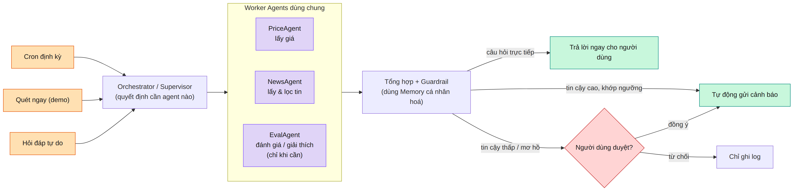

# Portfolio Watch & Chat Agent — Sơ đồ kiến trúc & diễn giải luồng dữ liệu

## Sơ đồ tổng quan (dùng để thuyết trình)

## Sơ đồ chi tiết (từng agent, từng node, từng tool)

## Diễn giải luồng dữ liệu, từng bước kèm mũi tên

**Bước 1 — khởi động:** Cron Trigger → Orchestrator giám sát (tự động, định kỳ), hoặc nút "Quét ngay" → Orchestrator giám sát (chọn một mã cụ thể để demo/kiểm tra ngay), hoặc câu hỏi tự do → Chat/Ask API → Rewrite Question → Supervisor RoutingDecision. Mỗi lượt chỉ đi theo đúng một trong ba lối này.

**Bước 2 — lấy dữ liệu song song (nhánh giám sát):** Orchestrator → PriceAgent, đồng thời Orchestrator → NewsAgent. Trong PriceAgent: fetch_latest_close(symbol) → tính % thay đổi so với phiên trước. Trong NewsAgent: LLM chọn từ khóa → gọi fetch_cafef_news(symbol) → nếu chưa đủ thì LLM lặp lại việc tìm thêm → khi đủ thì lọc ra tin thực sự liên quan.

**Bước 3 — phân loại sự kiện:** kết quả giá + kết quả tin → Event Classifier (LLM) → ra quyết định. Nếu "bình thường" → kết thúc, chỉ ghi log, không tốn thêm lời gọi LLM nào nữa. Nếu "bất thường" → đi tiếp sang bước 4.

**Bước 4 — đánh giá mức độ nghiêm trọng:** dữ liệu sự kiện → EvalAgent (LLM) → nếu cần thêm căn cứ thì gọi read_price_history(symbol) để so với lịch sử giá → khi đủ căn cứ, sinh ra Severity gồm mức độ nghiêm trọng, độ tin cậy, lý do và bằng chứng.

**Bước 5 — soạn nội dung:** Severity → SynthesisAgent, agent này đọc thêm read_user_memory(user_id) để biết sở thích của người dùng → chọn model theo độ phức tạp sự kiện → LLM soạn nội dung cảnh báo cụ thể → nội dung này đi qua Guardrail Output để kiểm tra không đưa lời khuyên mua/bán chắc chắn và khớp với bằng chứng thật; nếu vi phạm thì quay lại LLM soạn viết lại.

**Bước 6 — cổng độ tin cậy (điểm mấu chốt):** nội dung đã qua guardrail → kiểm tra "độ tin cậy có cao và khớp đúng ngưỡng người dùng đã đặt không?". Nếu có → tự động gửi email/push ngay, không cần ai duyệt, để giữ đúng giá trị cảnh báo thời gian thực. Nếu không (bằng chứng mơ hồ hoặc mâu thuẫn) → mới rơi vào HITL Gate 1, chờ người dùng bấm duyệt; duyệt thì mới gửi, từ chối thì chỉ ghi lý do vào Memory để hệ thống học lại ngưỡng cho lần sau. Dù đi đường nào, sau khi gửi thành công đều ghi lịch sử vào Memory.

**Bước 7 — nhánh phụ đổi cấu hình:** nếu EvalAgent thấy nên đổi ngưỡng cảnh báo hoặc thêm mã liên quan → đề xuất cấu hình → luôn phải qua HITL Gate 2 (không có đường tắt như bước 6, vì đây là thay đổi lâu dài) → duyệt thì ghi đè vào Watchlist Store, từ chối thì chỉ ghi lý do và giữ nguyên.

**Bước 8 — nhánh hỏi-đáp:** Supervisor RoutingDecision → gọi song song đúng những worker cần thiết (dùng lại PriceAgent/NewsAgent ở bước 2) → gộp kết quả. Nếu câu hỏi chỉ cần tra cứu → đi thẳng tới bước soạn câu trả lời. Nếu câu hỏi cần giải thích hoặc so sánh → đi qua EvalAgent trước (dùng lại đúng agent ở bước 4) rồi mới tới bước soạn câu trả lời → đọc Memory lấy hội thoại cũ để trả lời có ngữ cảnh → qua Guardrail Output → trả lời ngay cho người dùng, không qua bất kỳ cổng HITL nào vì đây chỉ là cung cấp thông tin, không có tác dụng phụ ra bên ngoài → lưu lại hội thoại vào Memory để dùng cho lần hỏi sau.
