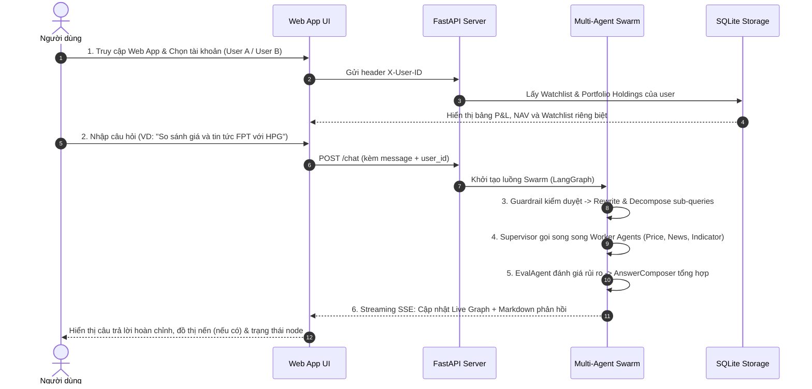

# Product Spec — VN Stock Swarm & Portfolio Watch (MVP Monorepo)

## 1. Goal (Mục Tiêu Ứng Dụng)

Xây dựng hệ thống Web App Multi-Agent Swarm (LangGraph) hỗ trợ phân tích chứng khoán Việt Nam và quản lý danh mục đầu tư đa người dùng theo chuẩn **Spec-Driven Development (SDD)**:
1. **Chuẩn hóa cấu trúc Monorepo (Monorepo Flattening)**: Đưa toàn bộ mã nguồn, cấu hình và tài nguyên từ thư mục con `llm-backend-ref-portfolio-watch/` ra thư mục gốc `vn-stock-swarm/`, tinh gọn đường dẫn, tối ưu quy trình Docker và CI/CD GitHub Actions.
2. **Hợp nhất và phát huy trọn vẹn năng lực Multi-Agent**:
   - Tra cứu giá thị trường, giá khớp lệnh, biên độ, lịch sử giá 10 ngày (PriceAgent).
   - Ma trận 10D Market Watch cho rổ VN30 (`/api/v1/market/matrix-10d`).
   - Tổng hợp tin tức tài chính đa nguồn Vnstock News & CafeF (NewsAgent).
   - Tính toán chỉ báo kỹ thuật RSI(14), SMA(20), SMA(50), Golden/Death Cross.
   - Đánh giá bất thường và xếp hạng rủi ro định lượng (EvalAgent).
   - Phân rã câu hỏi phức tạp / so sánh đa mã thành các sub-queries độc lập (RewriteBrain).
   - Quản lý danh mục đầu tư & tính toán Lãi/Lỗ thực tế (Unrealized P&L, NAV) theo từng người dùng (Multi-tenant).
   - Danh mục theo dõi (Watchlist) và cấu hình ngưỡng cảnh báo riêng biệt.
   - Sinh biểu đồ nến và chỉ báo kỹ thuật tự động bằng Matplotlib (ChartAgent).
   - Tường lửa an toàn Guardrails (chặn Prompt Injection, Out-of-scope, miễn trừ tư vấn).
   - Web App tương tác thời gian thực: Streaming SSE Markdown, Live Agent Graph cho phép hover xem system prompt và trạng thái của từng Node.
3. **Bộ Golden Dataset mới toàn diện (Minimal & Comprehensive)**: Thiết kế bộ dữ liệu đánh giá mới gồm 10 lát cắt chức năng với số lượng câu hỏi tối giản nhưng bao quát 100% tình huống thực tế.
4. **Quan sát định lượng (Observation & Trace)**: Thu thập và lưu vết chi tiết Token usage, Latency, Chi phí ước tính (Cost USD), Execution Trace và điểm chất lượng (Rule Pass Rate, LLM Judge).
5. **Kịch bản Demo chuẩn xác 100%**: Kịch bản chạy mẫu từng bước đảm bảo tất cả các chức năng đều trình diễn mượt mà trên Web UI.

---

## 2. Target Users (Đối Tượng Người Dùng)

1. **Nhà đầu tư chứng khoán cá nhân tại Việt Nam**:
   - Cần tra cứu nhanh thông tin giá, tin tức và xu hướng kỹ thuật cổ phiếu trong ngày.
   - Cần quản lý danh mục nắm giữ thực tế, theo dõi lãi/lỗ VND, % sinh lời và biến động tổng tài sản ròng (NAV).
   - Muốn đặt câu hỏi tự nhiên bằng tiếng Việt (câu đơn lẻ hoặc so sánh đa chiều phức tạp) và nhận câu trả lời phân tích có cơ sở.
2. **Kỹ sư AI / Nhà phát triển Agent**:
   - Cần một hệ thống Swarm mẫu phân tầng rõ ràng (LangGraph), có thể kiểm chứng định lượng chất lượng (Eval Pipeline).
   - Cần cơ chế giám sát chi phí vận hành (Cost Tracker) và chống suy giảm chất lượng (Regression Gate).

---

## 3. Core User Flow (Luồng Trải Nghiệm Người Dùng Cốt Lõi)

Quy trình trải nghiệm người dùng trên hệ thống gồm 6 bước khép kín:

* **Bước 1 (Chọn người dùng)**: Người dùng mở Web App tại `http://localhost:8000`, chọn tài khoản từ thanh User Switcher góc trên (`User A`, `User B`, `Default`).
* **Bước 2 (Xem danh mục & P&L)**: Giao diện nạp bảng Danh mục nắm giữ riêng biệt của tài khoản: số lượng, giá vốn, thị giá hiện tại, Lãi/Lỗ VND, % sinh lời và tổng NAV.
* **Bước 3 (Gửi câu hỏi)**: Người dùng nhập câu hỏi vào ô chat (hỏi giá, hỏi tin tức, hỏi chỉ báo kỹ thuật, so sánh 2 mã, yêu cầu vẽ biểu đồ nến, hoặc hỏi về danh mục).
* **Bước 4 (Xử lý Multi-Agent)**: 
  - `Guardrail`: Kiểm tra an toàn, loại bỏ câu hỏi độc hại hoặc ngoài phạm vi.
  - `RewriteBrain`: Chuẩn hóa tiếng Việt, sửa lỗi gõ («hiện tịa»), phân rã câu hỏi so sánh thành các sub-queries độc lập.
  - `Supervisor`: Phân phối nhiệm vụ cho các Worker Agents (PriceAgent, NewsAgent, IndicatorEngine, ChartAgent).
  - `EvalAgent`: Phân tích bất thường, định lượng rủi ro từ RSI/SMA và tin tức.
  - `AnswerComposer`: Tổng hợp phản hồi, định dạng bảng so sánh và bổ sung khuyến cáo rủi ro.
* **Bước 5 (Trải nghiệm thời gian thực)**: Giao diện streaming câu trả lời bằng Markdown, hiển thị đồ thị nến (nếu có yêu cầu) và cập nhật đồ thị Live Agent Graph theo thời gian thực (hover xem system prompt của node).
* **Bước 6 (Đánh giá & Kiểm thử)**: Kỹ sư/Admin chạy lệnh đánh giá tự động trên tập Golden Dataset để đo lường token, độ trễ và tỷ lệ đạt chuẩn.

---

## 4. Features in Scope (Phạm Vi Tính Năng MVP)

Hệ thống tập trung vào các tính năng thiết yếu, giải quyết trọn vẹn nhu cầu của người dùng:

1. **Chuẩn hóa Monorepo Root**:
   - Di chuyển toàn bộ mã nguồn từ thư mục con ra root, loại bỏ phụ thuộc trung gian.
   - Cập nhật `.github/workflows/` (CI Pipeline, Eval Gate, CD Pipeline) chạy trực tiếp tại root.
   - Đồng bộ `Dockerfile` và `docker-compose.yml`.
2. **Dữ liệu giá & Thị trường 10D**:
   - Tra cứu giá khớp lệnh, biên độ, lịch sử giá 10 ngày (PriceAgent).
   - API `/api/v1/market/matrix-10d` cung cấp ma trận giá và sparkline top 10 cổ phiếu VN30.
   - Cơ chế fallback dữ liệu mẫu khi thị trường đóng cửa hoặc mất mạng ngoài.
3. **Tin tức tài chính đa nguồn**:
   - Cào và tổng hợp tin tức nóng từ Vnstock News và CafeF (NewsAgent), có trích dẫn nguồn.
4. **Chỉ báo kỹ thuật định lượng**:
   - Tính toán RSI(14) (nhận diện vùng quá mua >70, quá bán <30), SMA(20), SMA(50).
   - Nhận diện giao cắt xu hướng Golden Cross (tăng giá) và Death Cross (giảm giá).
5. **Đánh giá bất thường & Rủi ro (EvalAgent)**:
   - Kết hợp chỉ số kỹ thuật và tin tức để xếp hạng rủi ro (`none`, `low`, `medium`, `high`).
6. **Phân rã câu hỏi đa ý (Query Decomposition)**:
   - Tự động tách câu hỏi so sánh hoặc đa mã thành các sub-queries độc lập, điều phối gom đủ dữ liệu.
7. **Quản lý danh mục & Lãi/Lỗ đa người dùng (Multi-tenant)**:
   - Lưu trữ vị thế (`symbol`, `quantity`, `avg_buy_price`, `purchase_date`) theo `user_id`.
   - Tính toán giá trị vốn, thị giá hiện tại, Unrealized P&L (VND & %) và Tổng NAV.
8. **Danh mục theo dõi (Watchlist) & Cảnh báo**:
   - Quản lý danh sách mã theo dõi và ngưỡng cảnh báo biến động (`alert_threshold_pct`) cho từng user.
9. **Vẽ biểu đồ nến kỹ thuật (ChartAgent)**:
   - Tự động vẽ biểu đồ nến kèm đường SMA bằng Matplotlib, trả về ảnh hiển thị trực tiếp trên chat.
10. **Tường lửa an toàn & Miễn trừ trách nhiệm**:
    - Chặn 100% Prompt Injection / Jailbreak.
    - Từ chối câu hỏi ngoài phạm vi tài chính chứng khoán.
    - Luôn đính kèm khuyến cáo rủi ro trung lập đối với câu hỏi xin ý kiến mua/bán trực tiếp.
11. **Giao diện Web UI trực quan**:
    - Chat Markdown streaming qua SSE, bảng Portfolio P&L, User Switcher.
    - Live Agent Graph: hiển thị mạng lưới agent động, hover xem system prompt và trạng thái từng node.
12. **Bộ Golden Dataset mới & Đo lường định lượng**:
    - File dataset 10 lát cắt chức năng (`specs/eval/golden_v6_comprehensive.yaml`).
    - Lưu vết chi tiết Token usage, Latency, Cost USD và chuỗi Execution Trace.
13. **Kịch bản Demo đầu cuối**:
    - Kịch bản 10 bước kiểm thử thành công 100% mọi chức năng trên giao diện.

---

## 5. Features out of Scope (Ngoài Phạm Vi MVP)

Để đảm bảo dự án tinh gọn, đúng trọng tâm và không bị over-engineering, các tính năng sau **không** thuộc phạm vi MVP này:

* **Không tích hợp đặt lệnh giao dịch thật**: Không liên kết API tài khoản chứng khoán (VPS, SSI, TCBS) để mua/bán tiền thật.
* **Không truyền phát Realtime WebSocket tick-by-tick**: Hệ thống sử dụng dữ liệu nến ngày 1D và polling giá khớp gần nhất.
* **Không xây dựng hệ thống Authentication phức tạp**: Không dùng OAuth2, JWT, SMS OTP, đăng ký/quên mật khẩu (sử dụng User Switcher / Header `X-User-ID` để phân tách tenant theo chuẩn MVP).
* **Không tính toán thuế & phí giao dịch nâng cao**: Chưa hỗ trợ tính thuế TNCN chi tiết, phí lưu ký, tỷ lệ vay margin hay điều chỉnh chia cổ tức phức tạp.

---

## 6. Acceptance Criteria (Tiêu Chí Nghiệm Thu Đo Lường Được)

Các tiêu chí nghiệm thu được đánh dấu cụ thể để kiểm chứng sau khi hoàn thành:

* [x] **AC-1 (Monorepo Flattening Thành Công)**: Toàn bộ source code, tests, resources và cấu hình nằm ở thư mục gốc `vn-stock-swarm/`; dự án chạy độc lập không còn phụ thuộc vào thư mục con `llm-backend-ref-portfolio-watch/`.
* [x] **AC-2 (Test Suite 100% Pass)**: Chạy lệnh `pytest tests/ -v` từ thư mục gốc, toàn bộ 178+ test cases đạt trạng thái PASS 100%, không phát sinh lỗi hồi quy (zero regression). Đã kiểm thử thực tế đạt 180/180 passed.
* [x] **AC-3 (CI/CD Pipeline Chuyển Xanh)**: Các workflow GitHub Actions (`ci.yml`, `eval-gate.yml`, `cd.yml`) được cập nhật đường dẫn chính xác và vượt qua kiểm thử tự động.
* [ ] **AC-4 (Core User Flow Hoạt Động Mượt Mà)**: Người dùng thực hiện trọn vẹn 6 bước trong luồng cốt lõi: chuyển đổi tài khoản, xem P&L, chat streaming, quan sát Live Graph và nhận biểu đồ nến mà không gặp lỗi 500.
* [ ] **AC-5 (Bao Phủ 10 Lát Cắt Golden Dataset)**: File dataset `golden_v6_comprehensive.yaml` bao phủ đầy đủ 10 lát cắt năng lực (`lookup`, `news`, `indicator`, `comparison`, `portfolio`, `watchlist`, `chart`, `out_of_scope`, `injection`, `disclaimer`).
* [ ] **AC-6 (Ghi Nhận Đầy Đủ Observation & Trace)**: Chạy pipeline đánh giá thành công, xuất file báo cáo `specs/eval/eval_summary_v6.md` và `.json` ghi nhận đầy đủ token, cost, latency và chuỗi trace qua các agent.
* [x] **AC-7 (Cô Lập Đa Người Dùng Tuyệt Đối)**: Thao tác thêm/xóa mã trong Watchlist, Holdings và thay đổi ngưỡng cảnh báo của `User A` không làm ảnh hưởng đến dữ liệu của `User B`. Đã kiểm chứng qua bài test `test_phase2_user_switcher_wiring_and_tenant_isolation` và `test_database.py`.
* [ ] **AC-8 (Kịch Bản Demo Thành Công 100%)**: Kịch bản kiểm thử 10 bước trong `specs/test-plan.md` được chạy thực tế trên Web UI và đạt kết quả thành công 100%.
* [ ] **AC-9 (Bảo Vệ An Toàn 100%)**: 100% câu hỏi Prompt Injection và Out-of-scope trong dataset mới được hệ thống từ chối an toàn và lịch sự.
* [ ] **AC-10 (Đồng Bộ Hồ Sơ SDD)**: Toàn bộ tài liệu đặc tả (`product-spec.md`, `implementation-plan.md`, `test-plan.md`, `change-log.md`, `README.md`, `AGENTS.md`) đồng bộ 100% với kiến trúc mã nguồn.
