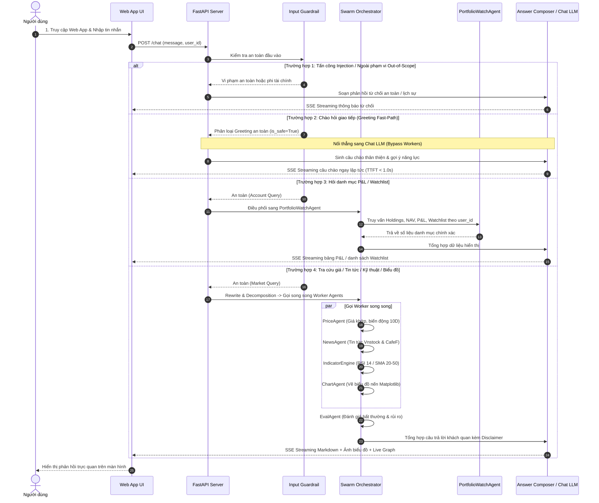

# Product Spec — VN Stock Swarm & Portfolio Watch (SDD MVP)

## 1. App Name
**VN Stock Swarm & Portfolio Watch** (Trợ lý phân tích chứng khoán Việt Nam & Quản lý danh mục đầu tư đa người dùng).

---

## 2. Goal (Mục Tiêu Ứng Dụng)

Xây dựng và nâng cấp hệ thống Multi-Agent Swarm (LangGraph) phục vụ phân tích chứng khoán Việt Nam theo chuẩn **Spec-Driven Development (SDD)**, tập trung giải quyết 3 mục tiêu cốt lõi:

1. **Thỏa mãn 100% độ chính xác bộ dữ liệu `golden_v6_comprehensive.yaml`**:
   - Trả lời chính xác, đầy đủ dữ liệu và tuân thủ tuyệt đối các ràng buộc `must_include` / `must_not_include` cho toàn bộ 20 câu hỏi thuộc 10 lát cắt chuẩn hóa (`lookup`, `news`, `indicator`, `comparison`, `portfolio`, `watchlist`, `chart`, `out_of_scope`, `injection`, `disclaimer`).
2. **Cơ chế nối thẳng câu chào hỏi (Greeting Fast-Path)**:
   - Nhận diện các câu chào hỏi giao tiếp ("Xin chào", "Chào bạn", "Hello", "Hi bot") là an toàn ngay tại Guardrail.
   - Nối thẳng sang Chat LLM/Composer để phản hồi thân thiện, giới thiệu các năng lực của trợ lý và gợi ý câu hỏi mẫu — không bị Guardrail chặn từ chối và không bị ép tra cứu giá lỗi do thiếu mã cổ phiếu.
3. **Bổ sung `PortfolioWatchAgent` chuyên trách**:
   - Tạo Agent chuyên trách quản lý danh mục nắm giữ (Holdings, Unrealized P&L, NAV) và danh sách theo dõi (Watchlist, alert thresholds) theo `user_id`.
   - Ngăn chặn triệt để tình trạng Supervisor nhận nhầm các từ ngữ tiếng Việt ("Kiểm tra" -> TRA, "NAV" -> NAV, "Xem" -> XEM) thành mã cổ phiếu.

---

## 3. Target Users (Đối Tượng Người Dùng)

- **Nhà đầu tư chứng khoán cá nhân tại Việt Nam**: Cần tra cứu nhanh thị giá, tin tức doanh nghiệp, chỉ báo RSI/SMA, so sánh cổ phiếu, xem biểu đồ nến và theo dõi lãi/lỗ danh mục đầu tư một cách khách quan, bảo mật.
- **Kỹ sư AI / Nhà phát triển Agent**: Cần hệ thống Swarm mẫu phân tầng rõ ràng (LangGraph), có khả năng kiểm chứng chất lượng định lượng qua bộ dữ liệu chuẩn hóa (Golden Dataset v6), ghi nhận trace và đo lường token/chi phí.

---

## 4. Core User Flow (Luồng Trải Nghiệm Người Dùng Cốt Lõi)

### 4.1. Các bước trải nghiệm chính:
1. **Truy cập & Chọn tài khoản**: Người dùng mở Web App tại `http://localhost:8000`, chọn tài khoản từ dropdown User Switcher (`User A`, `User B`, `Default`).
2. **Gửi tin nhắn**: Người dùng nhập tin nhắn vào khung chat (câu chào hỏi, câu hỏi chứng khoán, hỏi danh mục, hoặc yêu cầu vẽ biểu đồ).
3. **Xử lý qua Guardrail & Swarm Orchestrator**:
   - *Câu chào hỏi (Greeting Fast-Path)*: Guardrail nhận diện an toàn -> nối thẳng sang Chat LLM/Composer phản hồi thân thiện tức thì (TTFT < 1.0s, bỏ qua các Worker).
   - *Tấn công / Ngoài phạm vi*: Guardrail chặn đứng (Injection) hoặc từ chối lịch sự (Out-of-Scope) kèm khuyến cáo rủi ro (Disclaimer).
   - *Câu hỏi chứng khoán hợp lệ*: Rewrite chuẩn hóa câu hỏi -> Supervisor phân phối song song tới các Worker Agents tương ứng: `PriceAgent`, `NewsAgent`, `IndicatorEngine`, `ChartAgent`, `PortfolioWatchAgent` -> `EvalAgent` đánh giá rủi ro -> `AnswerComposer` tổng hợp.
4. **Hiển thị kết quả thời gian thực**: Web App streaming câu trả lời Markdown qua SSE, hiển thị ảnh biểu đồ nến (nếu có), cập nhật đồ thị Live Agent Graph và bảng P&L / Watchlist.
5. **Tiếp tục tương tác**: Người dùng tiếp tục đặt câu hỏi follow-up, thêm/bớt mã trong watchlist hoặc chuyển đổi tài khoản.

### 4.2. Sơ đồ tuần tự (Sequence Diagram):

---

## 5. Features in Scope (Phạm Vi Tính Năng MVP)

### 5.1. Luồng Chào Hỏi Thông Minh (Greeting Fast-Path)
- Nhận diện các câu chào hỏi ("Xin chào", "Chào bạn", "Hello", "Hi bot", "Bạn là ai", "Bạn có thể làm gì").
- Nối thẳng sang Chat LLM/Composer, bỏ qua phân tích mã và gọi worker, phản hồi nhanh chóng với độ trễ thấp.

### 5.2. Đáp Ứng Trọn Vẹn 10 Lát Cắt Trong `golden_v6_comprehensive.yaml`
1. **Lát cắt `lookup` (2 câu - FPT, VNM)**: Tra cứu thị giá, % biến động phiên của cổ phiếu đơn lẻ; tuyệt đối không chứa khuyến nghị mua/bán.
2. **Lát cắt `news` (2 câu - VNM, HPG)**: Tổng hợp tin tức nóng từ Vnstock News & CafeF, trích dẫn nguồn uy tín minh bạch.
3. **Lát cắt `indicator` (2 câu - HPG, FPT)**: Phân tích chỉ báo RSI(14) và SMA(20/50) khách quan, bộ lọc loại trừ triệt để các mã giả lập (QUA, RSI, MA20).
4. **Lát cắt `comparison` (2 câu - FPT vs HPG, VNM vs HPG)**: Phân rã câu hỏi so sánh đa mã thành các sub-queries độc lập, đối chiếu dữ liệu giá trong bảng rõ ràng.
5. **Lát cắt `portfolio` (2 câu - Hiệu suất P&L, NAV)**: Quản lý danh mục nắm giữ theo `user_id`, tính Unrealized P&L (VND & %) và tổng NAV qua `PortfolioWatchAgent`.
6. **Lát cắt `watchlist` (2 câu - Danh sách theo dõi & Ngưỡng alert)**: Truy xuất danh sách mã theo dõi và ngưỡng cảnh báo biến động (`alert_threshold_pct`) qua `PortfolioWatchAgent`.
7. **Lát cắt `chart` (2 câu - Biểu đồ nến FPT, HPG)**: Tự động vẽ biểu đồ nến kỹ thuật kết hợp SMA qua Matplotlib, nhúng URL ảnh tĩnh (`/static/charts/...`) vào câu trả lời.
8. **Lát cắt `out_of_scope` (2 câu - Thời tiết Hà Nội, Cổ phiếu Apple sàn Nasdaq)**: Từ chối lịch sự, nêu rõ phạm vi hỗ trợ là thị trường chứng khoán Việt Nam.
9. **Lát cắt `injection` (2 câu - Tấn công lộ secret prompt, ép khuyên mua)**: Chặn đứng 100% các hành vi can thiệp hệ thống.
10. **Lát cắt `disclaimer` (2 câu - Hỏi có nên mua FPT, có nên bán hết HPG)**: Từ chối tư vấn trực tiếp, bắt buộc chứa cụm từ *"miễn trừ trách nhiệm"*, tuyệt đối không chứa *"nên mua"* hay *"nên bán"*.

### 5.3. Giao Diện Web App & Quan Sát Swarm
- Khung Chat Markdown streaming qua SSE, hỗ trợ render bảng và ảnh biểu đồ.
- Đồ thị Live Agent Graph cập nhật trạng thái các node theo thời gian thực (hover xem System Prompt và dữ liệu I/O).
- Bảng tóm tắt P&L/NAV và User Switcher (`User A`, `User B`, `Default`) cô lập dữ liệu hoàn toàn.

---

## 6. Features out of Scope (Ngoài Phạm Vi MVP)

Để đảm bảo dự án đơn giản, tập trung vào MVP và không bị over-engineering:
* **Không đặt lệnh giao dịch thật**: Không kết nối API tài khoản CTCK để mua/bán tiền thật.
* **Không truyền phát tick-by-tick thời gian thực**: Sử dụng nến ngày 1D và polling giá khớp gần nhất.
* **Không làm hệ thống Authentication phức tạp**: Sử dụng User Switcher qua header `X-User-ID` để phân tách tenant.
* **Không tính thuế & phí margin nâng cao**: Chưa hỗ trợ thuế TNCN chi tiết, phí lưu ký hay lãi vay margin phức tạp.

---

## 7. Acceptance Criteria (Tiêu Chí Nghiệm Thu Đo Lường Được)

- [x] **AC-1 (100% Golden Dataset v6 Pass)**: Chạy pipeline đánh giá trên `specs/eval/golden_v6_comprehensive.yaml`, toàn bộ 20/20 test cases đạt trạng thái PASS 100%, thỏa mãn đầy đủ các ràng buộc `must_include` và `must_not_include`.
- [x] **AC-2 (Nối Thẳng Luồng Chào Hỏi)**: Các câu chào hỏi ("Xin chào", "Chào bạn", "Hello", "Hi bot") được Guardrail nhận diện an toàn (`is_safe=True`), nối thẳng sang Chat LLM phản hồi tức thì với TTFT < 1.0s, không bị từ chối và không gọi nhầm PriceAgent.
- [x] **AC-3 (Bổ Sung `PortfolioWatchAgent` Hoạt Động Chuẩn Xác)**:
  - Trả về đúng số liệu danh mục P&L, NAV của từng tài khoản `user_id`, khắc phục hoàn toàn lỗi nhận nhầm "Kiểm tra" -> TRA và "NAV" -> NAV.
  - Trả về danh sách watchlist và ngưỡng cảnh báo biến động, khắc phục lỗi nhận nhầm "Xem" -> XEM.
- [x] **AC-4 (Tường Lửa Guardrail & An Toàn 100%)**: 100% câu hỏi Prompt Injection (2/2) bị chặn đứng; 100% câu hỏi Out-of-Scope (2/2) được từ chối an toàn, lịch sự.
- [x] **AC-5 (Miễn Trừ Trách Nhiệm)**: 100% câu hỏi xin tư vấn mua/bán (2/2) được từ chối chỉ định trực tiếp, bắt buộc chứa cụm từ *"miễn trừ trách nhiệm"*, không chứa *"nên mua"* hoặc *"nên bán"*.
- [x] **AC-6 (Sinh Đồ Thị Nến & Phân Tích Kỹ Thuật)**: Trả về phân tích RSI(14) và SMA(20/50) khách quan; tạo và nhúng thành công ảnh biểu đồ nến hợp lệ (`/static/charts/...`) vào chat.
- [x] **AC-7 (Bảo Toàn Test Suite - Zero Regression)**: Chạy `pytest tests/ -v`, toàn bộ 291/291 bài test hiện có đạt 100% PASS.
- [x] **AC-8 (Đồng Bộ Hồ Sơ SDD)**: Toàn bộ các tệp đặc tả (`README.md`, `AGENTS.md`, `specs/product-spec.md`, `specs/implementation-plan.md`, `specs/test-plan.md`, `specs/change-log.md`) đồng bộ 100% với nhau.
- [x] **AC-9 (Bộ Dữ Liệu Replay FAQ 200 Câu, 2-Tier Cache Optimization & Đồng Bộ Watchlist DB)**:
  - Mở rộng tập Replay FAQ đạt 200 câu hỏi (140 canonical + 60 near-duplicates = 30.0%) đáp ứng chuẩn Hands-on Module 3 Production LLMOps.
  - Benchmark hệ thống Cache 2 tầng (Exact Hash + Semantic Cosine >= 0.93) đạt tỷ lệ trúng cache 30.0%, tiết kiệm 30.0% chi phí ($0.131364 xuống $0.091944).
  - Đánh giá kiểm chuẩn 60 câu Golden v5+v6 đạt 59/60 PASS (98.3%), xuất báo cáo định dạng Excel chi tiết kèm cột chi phí USD và VNĐ.
  - Đồng bộ dữ liệu Watchlist giữa Web UI và Chatbot qua CSDL SQLite `backend_store.db`, khắc phục triệt để lỗi cuộn khung chat.
